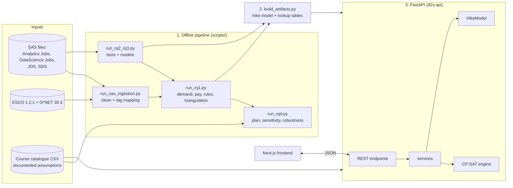
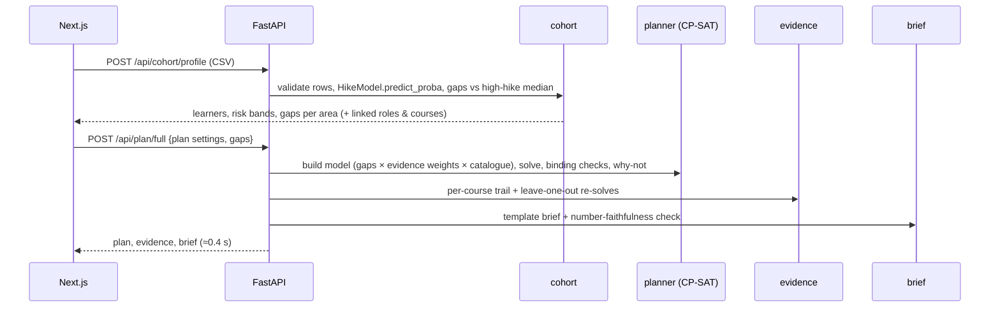

# D2S Bharat: Backend Architecture

> Status: **prototype-ready** (October 2026). Python 3.13, FastAPI, OR-Tools CP-SAT, scikit-learn,
> statsmodels, StatsForecast, sentence-transformers. ~4,700 lines in `backend/src/d2s`, 67 automated
> tests (1 slow test opt-in). Data: the four SAS hackathon files only; ESCO v1.2.1 and O\*NET 30.3 are
> used as a skill vocabulary.

Related documents: [core-services.md](core-services.md) (original design) · [xai.md](xai.md) ·
[`reports/aiml/README.md`](../reports/aiml/README.md) (model test results) ·
[`reports/rq1`](../reports/rq1/README.md), [`rq2_rq3`](../reports/rq2_rq3/README.md),
[`rq4`](../reports/rq4/README.md) (analysis).

---

## 1. Big picture

The backend has three stages that run at different times:

| Stage | When | What | Output |
|---|---|---|---|
| **1. Offline analysis pipeline** | once per data refresh (minutes) | clean SAS data, map skills, run RQ1–RQ4 statistics | `dataset/processed/*` tables |
| **2. Artifact build** | after stage 1 (~1–2 min) | train the hike model, precompute lookup tables and embedding cache | `dataset/artifacts/*` |
| **3. Online API** | always on | load artifacts at start-up; answer requests in ms; run CP-SAT live | JSON over HTTP |



---

## 2. Package layout (`backend/src/d2s`)

Layers depend only downwards: **api → services → (models, engine, analysis, ml, ingest) → config**.
Persistence sits beside the services: **api → db (repositories) → SQLAlchemy → Supabase Postgres + pgvector**.

```
d2s/
├── config.py            Settings (env vars D2S_*: dataset dir, embedding model, solver limits, queue)
│
├── api/                 ── Layer 4: HTTP ──
│   ├── main.py          FastAPI app, routes per screen, error mapping (404/422/503), CORS
│   ├── auth.py          JWT auth: register / login / me, Argon2 hashing, app-wide guard
│   ├── routes_db.py     DB routes: course catalogue CRUD, saved cohorts, plan-run history
│   ├── db.py            engine per process, session per request; database-or-files catalogue source
│   └── state.py         start-up loading (model, tables, SAS cohort); background warm-up of skill lookup
│
├── agents/              ── Agentic AI (LangGraph + local qwen3:1.7b via Ollama; offline) ──
│   ├── llm.py           constrained choices from the local model (enum JSON); warm-up; status
│   ├── extract.py       numbers, courses, areas and intents read from the question (never by the model)
│   ├── tools.py         tools = existing services (optimise, what-if, confidence, baselines, why-not, Plan A/B/C)
│   ├── copilot.py       Agent 1: route -> (fast | model choose) -> act -> answer
│   ├── stress.py        Agent 2: baseline -> probes -> explore -> follow-ups -> report
│   └── intake.py        Agent 3: parse -> map -> model -> scales -> review (interrupt) -> apply
│
├── vector/              ── Vector store (ChromaDB) ──
│   └── store.py         market-skill collection per embedding model (cosine); built on first start
│
├── db/                  ── Persistence (optional; Supabase Postgres + pgvector) ──
│   ├── base.py          engine factory (Supabase URL/TLS/pooler handling), unit of work, Embedding type
│   ├── models.py        courses, cohorts, plan_runs, market_skills (vector(384) + HNSW index)
│   ├── repositories.py  Course / Cohort / PlanRun / Skill repositories (only code touching ORM rows)
│   ├── schema.py        create extension vector + tables (idempotent)
│   └── seed.py          load catalogue CSV and market skills with cached embeddings
│
├── services/            ── Layer 3: application services (what the screens need) ──
│   ├── store.py         paths + cached loaders for processed tables and artifacts
│   ├── market.py        Command Center: overview, demand, pay, bundles, triangulation, SkillLookup
│   ├── cohort.py        Gap Map: validate cohort CSV, per-learner probability, gaps, links to roles/courses
│   ├── planner.py       optimise, binding verdict, why-not, Plan A/B/C, confidence, baseline comparison, frontier
│   ├── whatif.py        "What happens if..." simulator: scenario -> re-optimised plan vs today's
│   ├── evidence.py      Evidence Trail: signal → gap → constraint → optimisation → intervention
│   ├── brief.py         Decision Brief (template, T0) + number-faithfulness check
│   └── insights.py      Junior / Senior insights (senior: aggregate only)
│
├── models/              ── Layer 2: trained models ──
│   └── hike.py          HikeModel: L2 logistic + bootstrap ensemble, contributions, counterfactuals
│
├── engine/              ── Layer 2: decision engine (pure, no I/O) ──
│   ├── schemas.py       SkillGap, Course, Constraints, PlanningProblem → Plan
│   ├── model.py         CP-SAT model builder + input validation (cycles, unknown prereqs, budget floor)
│   ├── solver.py        solve(): parameters, hints, progress callback, status mapping
│   ├── sensitivity.py   GLOP LP shadow prices + exact finite-difference marginals
│   ├── pareto.py        ε-constraint cost–impact frontier (lexicographic)
│   ├── baselines.py     naive rules (biggest gap / most in-demand / cheapest seats) scored like the optimiser
│   ├── alternatives.py  Plan A/B/C: k best structurally different portfolios (no-good cuts on course sets)
│   └── explain.py       why_not(): forced re-solve + static blockers
│
├── analysis/            ── Layer 2: statistical analysis used by pipeline and services ──
│   ├── traits.py        RQ2/RQ3: audit, Mann–Whitney + effect sizes, L2-logit, tree, permutation test
│   ├── jobs.py          RQ1: role families, canonical skills, Wilson CIs, ordinal logit, rules, JDS areas
│   └── plan.py          RQ4 inputs: cohort gaps, evidence weights (3 schemes × CI bounds), catalogue
│
├── ingest/              ── Layer 1: data preparation ──
│   ├── parsing.py       SAS loaders (dedupe, parse bands/ranges, repair tags, cleaning log)
│   ├── sas.py           tag → ESCO/O*NET mapping, text extraction, threshold calibration
│   └── pipeline.py, crosswalk.py, evaluate.py   (generic helpers; see §9 "legacy")
│
├── ml/                  ── Layer 1: ML building blocks ──
│   ├── embeddings.py    Embedder protocol: SentenceTransformerEmbedder (bge-small), HashingEmbedder (tests)
│   ├── taxonomy.py      O*NET 30.3 + ESCO CSV loaders
│   ├── skills.py        SkillMatcher: lexicon rules, acronym keys, boilerplate filter, hybrid matching
│   └── forecasting.py   DemandForecaster (StatsForecast) — validated, dormant (no dates in SAS data)
│
└── workers/             ── optional: background jobs (built, not used by the prototype) ──
    ├── registry.py, tasks.py, queue.py (InlineQueue / ArqQueue), progress.py, worker.py
```

**Design rules**
- `engine/` and `models/` are pure Python with Pydantic inputs and outputs: no files, no HTTP. They are
  testable in isolation and reusable from scripts, the API or workers.
- Services orchestrate: they load data via `store`, call models and the engine, and return Pydantic
  objects that FastAPI serialises directly.
- Every number shown to a user comes from a table or a solve, never from free text.

---

## 3. Offline pipeline (stage 1 and 2)

Run in this order (`cd backend`, `uv run python scripts/<name>`):

| # | Script | Reads | Writes (`dataset/processed/…`) | Time |
|---|---|---|---|---|
| 1 | `run_sas_ingestion.py` | Analytics Jobs, DataScience Jobs, taxonomy | `sas/`: cleaned posts, tag mapping, review queue, raw text matches, calibration | ~4.5 min (first run builds the label index) |
| 2 | `run_rq2_rq3.py` | JDS, SDS | `rq23/`: univariate tests, models, odds ratios, trees, summary | ~1 min |
| 3 | `run_rq1.py` | outputs of 1 + 2 | `rq1/`: canonical skills, demand, adjusted pay, rules, triangulation | ~1–2 min |
| 4 | `run_rq4.py` | outputs of 1–3, catalogue | `rq4/`: plan, sensitivity, Pareto, robustness | ~1 min |
| 5 | `build_artifacts.py` | outputs of 1–3 | `dataset/artifacts/`: `hike_model.pkl/.json`, `skill_stats.csv`, `area_roles.csv`, `skill_lookup.npz` | ~1–2 min |
| – | `evaluate_aiml.py [section]` | artifacts | `reports/aiml/` charts + metrics | ~7 min (all sections) |
| – | `make_sas_report.py`, `make_report_assets.py` | processed outputs | report charts and LaTeX tables | < 1 min |

**Artifacts** (loaded by the API at start-up):

| File | Content | Size |
|---|---|---|
| `hike_model.pkl` | standardisation, coefficients, 300 bootstrap refits, high-hike medians, training ranges | 15 KB |
| `hike_model.json` | model card: data, algorithm, C, coefficients, CV AUC, intended use, not-for | 1 KB |
| `skill_stats.csv` | 6,772 canonical skills: demand (all / data roles), median salary midpoint, top family | 0.5 MB |
| `area_roles.csv` | JDS skill area × role family: share of postings requiring the area | 3 KB |
| `skill_lookup.npz` | cached embeddings of 2,908 skills (≥ 3 postings) + model name | 4 MB |

---

## 4. Online API (stage 3)

Start: `uv run uvicorn d2s.api.main:app --port 8000 --reload` → docs at `/docs`.

**Start-up** (`lifespan`): load the hike model, `area_roles`, catalogue, triangulation table and the
SAS JDS cohort (profiled once to get default gaps). A background thread loads the sentence-transformer
(~15 s) and the cached skill embeddings; until it is ready `/api/market/skills/search` returns 503
"warming up" and everything else already works. Load failures are reported in `/api/health` rather than
crashing the server.

| Screen | Method & path | Service | Measured latency |
|---|---|---|---|
| Meta | `GET /api/health`, `GET /api/model/card` | state, store | < 10 ms |
| Command Center | `GET /api/overview` | market | 8 ms |
| | `GET /api/market/demand?scope=data\|all&top=` · `/pay` · `/bundles` · `/triangulation` · `/titles` | market | 4–20 ms |
| | `GET /api/market/skills/search?q=&k=` | market.SkillLookup | ~25 ms (p95 31 ms) |
| Gap Map | `POST /api/learner/predict` `{scores, target_probability}` | HikeModel.explain | 6 ms |
| | `POST /api/cohort/profile` (multipart CSV/XLSX, ≤ 2 MB) | cohort.profile | — |
| | `GET /api/cohort/sample` | cohort.profile (SAS JDS) | 145 ms |
| What-If | `GET /api/plan/catalogue` | — | — |
| | `POST /api/plan/solve` · `/robustness` · `/frontier` | planner | solve < 0.3 s |
| | `POST /api/plan/alternatives?k=3&min_diff=1` | engine.alternatives | Plan A = optimum; Plan B/C = best plans differing in ≥ min_diff courses, with trade-off text · ~0.2 s |
| Evidence Trail | `POST /api/plan/evidence` | evidence | — |
| Decision Brief | `POST /api/plan/brief`; **`POST /api/plan/full`** (plan + evidence + brief) | brief | **0.44 s** total |
| Insights | `GET /api/insights/junior` · `/senior` | insights | 17 ms |

**Plan request body** (all optional):
```json
{
  "plan": {"budget": 400000, "trainer_hours": 200, "scheme": "balanced", "bound": "point",
           "forced_in": [], "forced_out": []},
  "gaps": {"maths_stats_skills": 82, "coding_skills": 77}
}
```
`gaps` defaults to the SAS JDS cohort; partial gaps override only the listed areas.

**Errors:** validation errors → 422 with the reason (out-of-range score, unknown skill area, unknown
scheme, unreadable or oversized file); missing artifact → 503 naming the script to run; skill lookup not
ready → 503. CORS allows `localhost:3000` (Next.js dev server).

---

## 5. The AI/ML components

| Component | Technique | Trained on | Tested result |
|---|---|---|---|
| **HikeModel** | standardised L2 logistic regression, C by 5-fold CV on log-loss; 300-refit bootstrap ensemble for probability ranges; exact log-odds contributions; single-skill counterfactuals | SAS JDS (139) | test AUC **0.900** over 200 random 75/25 splits, beating random forest (0.878), boosting (0.838) and tree (0.810); Brier 0.117; well calibrated |
| **Cohort profiler** | HikeModel + gap to high-hike median + risk bands | — | 93% of "at risk" truly low hike; 90% of "on track" truly high |
| **Skill normalisation** | lexicon (labels, filtered alt labels, O*NET acronym keys, "contains") then bge-small embeddings (≥ 0.85; one-word ≥ 0.90) | ESCO + O*NET (22,758 skills) | 100% of tag uses resolved (56.4% to ESCO/O*NET); manual spot-check corrections documented |
| **SkillLookup** | bge-small query embedding vs cached skill embeddings | 2,908 SAS skills | 24 ms median |
| **Decision engine** | CP-SAT integer programming; GLOP duals; ε-constraint Pareto | — | 40/40 identical to brute force; 18/18 benchmark runs proven optimal (≤ 3.3 s at 150 courses) |
| **DemandForecaster** | StatsForecast; demand-pattern routing; adaptive backtest windows; ETS+ARIMA combination; conformal intervals with zero floor | public test data only | AirPassengers MAE 18.5 vs 47.8 seasonal naive; intermittent 80% intervals cover 80.0% |
| **BriefWriter** | deterministic templates + regex number-trace check | — | 69/69 numbers traced in the live brief |

**Explainability (XAI) built in:** per-skill contributions and counterfactuals (learner); binding-constraint
verdict from exact re-solves, why-not for every excluded course, leave-one-out impact per chosen course,
9-scenario robustness (plan); evidence trail with the market and RQ2 numbers behind each course; the brief
can only state numbers the engine produced.

---

## 6. Data flow for the main user journey



---

## 7. Quality and testing

`uv run pytest` (67 tests, ~30 s) · `uv run pytest -m slow` (500-series forecaster scale test).

| Test file | Covers |
|---|---|
| `test_engine.py` | feasibility invariants, brute-force optimum, prerequisites, either/or, saturation, infeasible / invalid inputs, shadow prices, Pareto, why-not |
| `test_ml.py` | embeddings, clause splitting, lexicon rules (alt labels, acronyms, ambiguous words), O*NET loader, forecaster routing |
| `test_forecasting_real.py` | AirPassengers vs seasonal naive, intermittent coverage, messy input, scale |
| `test_analysis.py`, `test_plan.py` | statistics on synthetic data with known effects; gaps and evidence weights |
| `test_services.py` | HikeModel (drivers, contributions sum, counterfactual minimality, persistence), cohort validation, brief number check, end-to-end cohort → plan → evidence → brief on real artifacts |
| `test_api.py` | every endpoint family, validation errors, CSV upload, plan/full |
| `test_workers.py` | task registry, inline queue, progress streaming, retries, idempotency |

Bugs found by these tests and fixed include: sentence-end punctuation breaking exact matches, ESCO
"knowledge" skills excluded by mistake, forecasting silently dropping off-anchor dates, wrong model
selection with 2 backtest windows, intermittent intervals under-covering (59% → 80%), untraced numbers
in the brief, and banker's rounding of rupee amounts.

---

## 8. Configuration

`d2s/config.py` (environment variables prefixed `D2S_`, or a `.env` file):

| Variable | Default | Purpose |
|---|---|---|
| `D2S_DATASET_DIR` | `../dataset` | processed tables and artifacts |
| `D2S_EMBEDDING_MODEL` | `BAAI/bge-small-en-v1.5` | skill embeddings (index cache is keyed by model name) |
| `D2S_EMBEDDING_BACKEND` | `torch` | `onnx`/`openvino` for faster CPU, `hashing` for tests |
| `D2S_MATCH_THRESHOLD` | `0.75` | semantic match cut-off for the worker matcher |
| `D2S_SOLVER_TIME_LIMIT_S` / `_WORKERS` / `_GAP_LIMIT` / `_SEED` | 10 / 8 / 0.005 / 42 | CP-SAT defaults (API planner uses 10 s, gap 0) |
| `D2S_QUEUE_BACKEND` / `D2S_REDIS_URL` | `inline` / `redis://localhost:6379/0` | optional worker queue |
| `D2S_DATABASE_URL` | unset | Supabase connection string; unset = files only (all non-DB endpoints still work) |
| `D2S_DATABASE_ECHO` | `false` | log SQL |
| `D2S_JWT_SECRET` | unset | HS256 signing key, >= 32 chars (auth endpoints answer 503 without it) |
| `D2S_JWT_TTL_MINUTES` | `720` | access-token lifetime |
| `D2S_AUTH_REQUIRED` | `true` | `false` turns the guard off (tests, offline demos) |

Dependencies are grouped in `pyproject.toml`: core (pydantic, numpy, pandas, ortools), `ml`
(statsforecast, sentence-transformers), `api` (fastapi, uvicorn, python-multipart), `workers` (arq,
redis), `db` (sqlalchemy 2, psycopg 3, pgvector), groups `dev` (pytest, ruff) and `viz` (matplotlib, openpyxl).

---

## 9. Not in the prototype (and why)

| Item | Status | Reason / plan |
|---|---|---|
| Demand forecasting in the product | module validated, **dormant** | SAS files have no dates; activates when dated postings (e.g. NCS) are connected |
| Background workers (arq + Redis) | built, inline-tested; **arq + real Redis not run** | not needed: every solve < 1 s; needs Redis (Memurai) for a real test |
| Database migrations | `create_all` via `scripts/db_init.py` | tables are created idempotently; move to Alembic / Supabase migrations when the schema starts changing |
| Auth, multi-tenancy, audit log | not built | prototype is single-user |
| Own SLM for the brief | not built | template brief (T0) is the guaranteed-faithful fallback by design |
| Multi-institution pooling, multi-period plans | designed only | no institution-level data in the SAS files |
| Decision backtesting | not possible | needs historical, dated data |
| **Legacy code** | `scripts/run_ingestion.py`, `make_ingestion_report.py`, `eval_matching_variants.py`, `ingest/pipeline.py`, `crosswalk.py`, `evaluate.py` | from the earlier Naukri experiment; kept for the matcher evaluation, **not used for any SAS result** |

**Known limits of the deployed models:** the hike model is trained on 139 sample records (associations, not
causes; the model card says "not for hiring or pay decisions about individuals"); skill matching uses a small
general-purpose embedding model; RQ4 costs are documented assumptions (`reports/rq4/course_catalogue_assumptions.csv`).

---

## 10. Run it

```bash
cd backend
uv sync --all-extras                       # Python 3.13
# one-off pipeline (stage 1-2)
uv run python scripts/run_sas_ingestion.py
uv run python scripts/run_rq2_rq3.py
uv run python scripts/run_rq1.py
uv run python scripts/run_rq4.py
uv run python scripts/build_artifacts.py
# serve (stage 3)
uv run uvicorn d2s.api.main:app --port 8000 --reload     # http://127.0.0.1:8000/docs
# database (optional): Supabase > Project Settings > Database > Connection string (session pooler, port 5432)
export D2S_DATABASE_URL="postgresql://postgres.<ref>:<password>@aws-0-<region>.pooler.supabase.com:5432/postgres"
uv run python scripts/db_init.py           # enables pgvector, creates tables + HNSW index, seeds catalogue + skills
# test
uv run pytest
```

---

## 11. Persistence (SQLAlchemy + Supabase)

**Why a database at all:** the analysis outputs are read-only files, but three things in the product change
over time and must be shared: the institution's **course catalogue** (costs, seats, trainer-hours change),
its **cohorts** (each upload), and the **decision history** (every plan that was run, with its inputs and
result). Vectors are not in Postgres: semantic **skill search** uses ChromaDB (section 13).

| Table | Written by | Read by |
|---|---|---|
| `courses` | `PUT/DELETE /api/courses/{id}`, seed | every solve (`catalogue_source()`), Gap Map course links |
| `cohorts` | `POST /api/cohort/profile` (returns `cohort_id`) | `PlanBody.cohort_id` -> that cohort's gaps |
| `plan_runs` | `/api/plan/full` (`run_id` in body), `/api/plan/alternatives` (`X-Plan-Run-Id` header) | `GET /api/plan/runs`, `/api/plan/runs/{id}` |

**Layering.** Routes never touch ORM rows; they call repositories, which translate rows to domain objects
(`engine.Course`, dicts) and back. One `Session` per request (FastAPI dependency) is one unit of work:
commit on success, rollback on any error. Several repositories can share it.

**Optional by design.** With `D2S_DATABASE_URL` unset, nothing changes: the catalogue comes from the CSV,
skill search from the in-memory index, and the DB routes answer 503 with a hint. If the database is
unreachable at start-up, `/api/health` shows the error and the file-based API keeps working. Saving a plan
run never fails the request that produced the plan.

**Catalogue rules.** A deactivated course is kept (history still refers to it) but not offered to the
optimiser; a course whose prerequisite is inactive is left out too, transitively. A course cannot be deleted
while another course lists it as a prerequisite. Coverage keys must be the five SAS skill areas.

**Supabase specifics** (`db/base.py`): `postgres://` URLs are switched to the psycopg 3 driver; TLS
(`sslmode=require`) is added for remote hosts; on the transaction pooler (port 6543) prepared statements
are disabled; connections are pre-pinged and recycled every 30 min. Use the session pooler (5432) or the
direct connection for the API server.

**Testing.** `tests/test_db.py` runs the same models and repositories on in-memory SQLite (vectors stored as
JSON, exact NumPy cosine search) and drives the DB-backed API end to end: catalogue edit -> re-solve,
plan-run history, cohort upload -> plan by `cohort_id`. The Postgres DDL (`VECTOR(384)`, HNSW index) and the
`<=>` query were checked by compiling against the Postgres dialect; they have not yet run on a live Supabase
project.

---

## 12. Authentication (JWT)

| Endpoint | Purpose |
|---|---|
| `POST /api/auth/register` `{name, email, password}` | create account, returns a token (201; 409 if the email exists) |
| `POST /api/auth/login` `{email, password}` | returns `{access_token, expires_at, user}` |
| `POST /api/auth/token` (form) | same, OAuth2 password form: powers the Swagger **Authorize** button |
| `GET /api/auth/me` | current user (checks the account still exists and is active) |

**Guard.** One app-wide dependency (`auth_guard`): every route except `/api/health` and `/api/auth/*`
needs `Authorization: Bearer <token>`, otherwise 401 with `WWW-Authenticate: Bearer`.

**Passwords.** Argon2id (pwdlib). Minimum 8 characters, not trivially uniform. Login verifies against a
dummy hash for unknown emails and returns the same message for wrong email and wrong password, so
neither timing nor wording reveals which emails have accounts.

**Tokens.** HS256, claims `sub` (user id), `email`, `name`, `iat`, `exp`, `typ=access`; 12 h by default.
Verification is stateless, with no database round trip per request (which matters with Supabase about
0.4 s away). Trade-off: disabling an account takes effect at token expiry, not instantly. There are no refresh
tokens; the user signs in again after 12 h.

**Data isolation.** `cohorts` and `plan_runs` carry `user_id`. The repositories take an `owner`: reads
are filtered to it and writes stamped with it; another user's id answers 404, exactly like a missing id.
The course catalogue is shared (institution-wide); any signed-in user may edit it (no roles yet).

**Supabase side door closed.** Supabase publishes the `public` schema through its REST API to the
`anon`/`authenticated` roles. `create_schema` enables row-level security (no policies) on every table,
so that API sees nothing (including `users.password_hash`), while the backend's owner connection
is unaffected.

**Frontend.** The session (token, expiry, user) lives in `localStorage`; every API call sends the bearer
token. Signed-out visits redirect to `/login?next=…` (same-site paths only), and sign-out does a full
page load that also clears the cohort and cached plans. Expiry, or any 401 from the API, signs the user
out with a message. Trade-off: a token in `localStorage` is readable by script on the page, so an XSS bug
would expose it. An httpOnly cookie is the stronger option once frontend and API share a domain.

**Tests.** `tests/test_auth.py`: register, login and validation; the guard; forged-signature, expired,
unsigned (`alg=none`), wrong-type and bit-flipped tokens; and per-user isolation of cohorts and runs.
The browser flow (redirects, sign-out, `?next=` open-redirect attempt, forged token) was checked
end to end with Playwright.

---

## 13. Vector store (ChromaDB)

Skill embeddings live in a ChromaDB collection, `market_skills__<model>`: one record per canonical skill
seen in the SAS postings (2,908), with its embedding and market evidence (posting counts, shares, median
pay, pay odds ratio and CI) as metadata, so a search answers in one call. Cosine space; similarity =
1 - distance. Embeddings come from our own model (`BAAI/bge-small-en-v1.5`); Chroma's embedding
function is off. One collection per model, so vectors from different models never mix.

* **Where:** embedded and persistent at `<dataset>/chroma` by default; set `D2S_CHROMA_HOST`
  (+ `_PORT`, `_SSL`) to use a Chroma server.
* **Build:** automatically on first API start if empty (from the cached `skill_lookup.npz`, otherwise
  by embedding the names); `scripts/build_vector_index.py --query pytorch` rebuilds it and checks it.
* **Fallback:** if Chroma is unavailable, search uses the in-memory index; `/api/health` reports
  `vector_store`.
* Chroma drops `None` metadata values; the store omits them on write and restores every field on read.
* Postgres keeps only relational data (users, courses, cohorts, plan runs); pgvector was removed.

## 14. Confidence, baselines and "What happens if..."

**Confidence** (`POST /api/plan/confidence`). The plan is re-optimised under the 9 ways of reading the
evidence: 3 priority schemes x the low / point / high ends of every 95% interval. For each recommended
course, `chosen_in / 9` gives its confidence: high >= 85%, medium >= 50%, otherwise low. The plan-level
score is the mean. The response also reports how often exactly the same course set comes out. SAS
default: high (96%); 4 of 5 courses in 9/9 readings, Tableau storytelling in 7/9.

**Naive baselines** (`full.baselines`; `POST /api/plan/baselines` adds a budget sweep). Three rules
planners use: *biggest gap first*, *most in-demand first*, *cheapest seats first*. Each is filled
greedily under the same constraints (budget, hours, seat caps, minimum batch, prerequisites, either/or
groups, mandatory courses first) and scored with the optimiser's own objective. Tests check that no rule
beats the optimiser and that the scoring formula reproduces the solver's objective exactly. Honest
reading: at some budgets one rule happens to match the optimum, but which rule wins changes with the
budget. At the SAS defaults the optimiser beats the average rule by 26%, and across budgets of 25-200%
the rules' worst cases are 56%, 63% and 82% of the optimum.

**What happens if...** (`POST /api/plan/what-if`, presets at `GET /api/plan/what-if/presets`). A scenario
can combine: budget %, trainer-hours +/-, courses dropped or required, course prices %, demand per skill
area %, and learners short %. It returns today's and the re-optimised plan, courses added, dropped and
moved, gap closure before and after, whether today's plan still fits, and today's plan re-valued under
the new conditions, so the gain from re-planning is explicit. When extra money or hours change nothing,
a re-solve with the other resource relaxed tells which one is the real limit. When nothing is feasible,
the CP-SAT assumption core lists the conflicting requirements in plain words. About 60-110 ms per
scenario.

---

## 15. Agents (LangGraph, offline)

**Stack.** LangGraph 1.2 state graphs and `langchain-ollama` → **Ollama `qwen3:1.7b`** running locally
(1.4 GB, no API key, thinking off, kept in memory). No LangChain agent executor and no third-party LLM API.

**Model choice (measured on the team laptop: 15 GB RAM, no GPU).** `llama3.2:1b` took 1.7 s per decision
but picked the right tool only 1 time in 6, with garbled arguments. `qwen3:4b` took over 3 minutes (it
swaps). **`qwen3:1.7b`** takes 1.8 s warm and picks the right first tool reliably. Free-form tool calling
invented arguments (e.g. `cost_pct: 30` for a budget cut), so the model is used **only for constrained
choices**: Ollama structured output with enum fields (which tool, which follow-up scenario, which column).
Every number and course name is read from the user's text by `agents/extract.py`. When the question
implies a change without a size ("a trainer leaves"), a documented default is used and shown to the
user as an assumption.

| Agent | Graph | Where | Typical time |
|---|---|---|---|
| **1. Planning Copilot** | `route` (deterministic) → `act` → `answer`; if unsure: `choose` (model) → `act` → `answer` | `/copilot` | fast path 0.1–0.5 s; model path 2–8 s |
| **2. Stress-test** | `baseline` → `probes` (18 shocks + bisection breakpoints) → `explore` (model picks combinations) → `follow_ups` → `report` | What-if page | 6–8 s, streamed |
| **3. Data-Intake** | `parse` → `map_rules` (aliases, meaning) → `map_model` (leftovers only) → `scales` → `review` (**`interrupt()`**) → `apply` | Cohort page | proposal < 1 s; waits for the user |

**Safeguards.**
- Answers are written from the tools' own result lines, and a test checks that every number in an
  answer comes from tool output.
- Beyond its first choice, the model's picks are dropped unless the question supports them.
- At most 4 tool calls per question.
- The intake applies nothing until a human approves, and the user can edit the mapping or scales
  first.
- If the model is off or fails, every agent still works: the Copilot answers on the fast path or gives
  help, the stress test picks the most severe combinations itself, and the intake leaves unmapped
  columns to the human.

**Tie-stability.** CP-SAT on 8 threads can return different but equally good plans. The simulator
never reports a change that gains nothing (today's plan is kept when it is still optimal). The stress
test's breakpoints test "keeping today's courses is still optimal", not "the solver happened to return
the same courses". Repeated runs give identical reports.

**API.** `GET /api/agents/status`; `POST /api/agents/copilot` and `/stress-test` (server-sent events:
one `step` event per graph step, then `result`); `POST /api/agents/intake` (proposal plus `thread_id`) and
`POST /api/agents/intake/{thread_id}` (approve or edit); `GET /api/agents/runs`. Every run (question, path,
steps, answer, time) is stored per user in `agent_runs`.

**Config.** `D2S_OLLAMA_URL`, `D2S_AGENT_MODEL` (default `qwen3:1.7b`), `D2S_AGENT_KEEP_ALIVE`,
`D2S_AGENT_LLM_ENABLED` (tests set it to false and use a scripted chooser). `ollama pull qwen3:1.7b` once.

**Tests.** `tests/test_agents.py` (29 tests): extraction of 17 phrasings; fast path never calls the
model; only the model's first choice is trusted; help when the model is off or the question is off-topic;
stress report under both the scripted model and the fallback; intake for messy names, word and 10-point
scales, edits, cancel and an incomplete mapping; the event-stream API; and tie-stability. A browser run
with the real model covered all three agents end to end.

