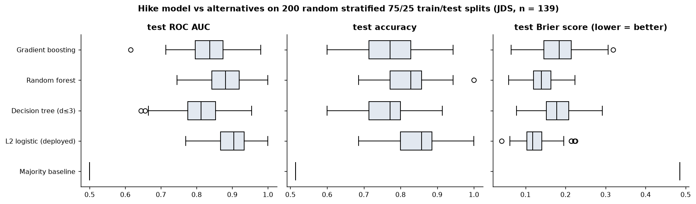
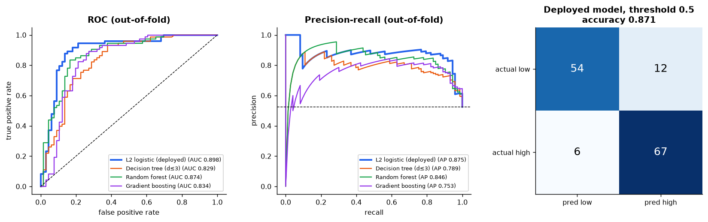
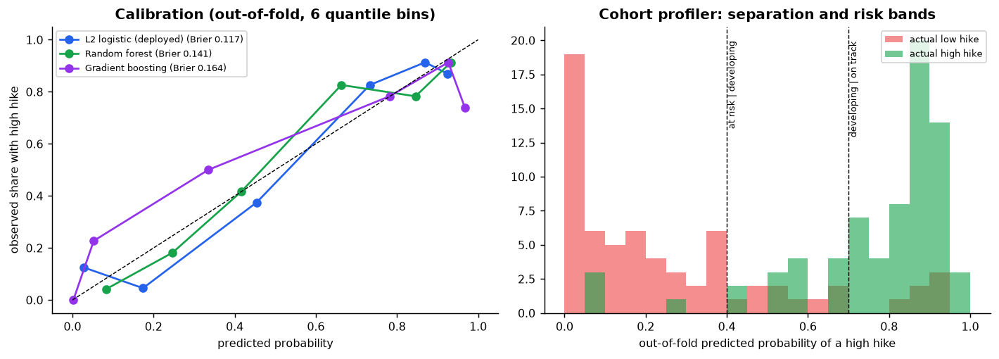
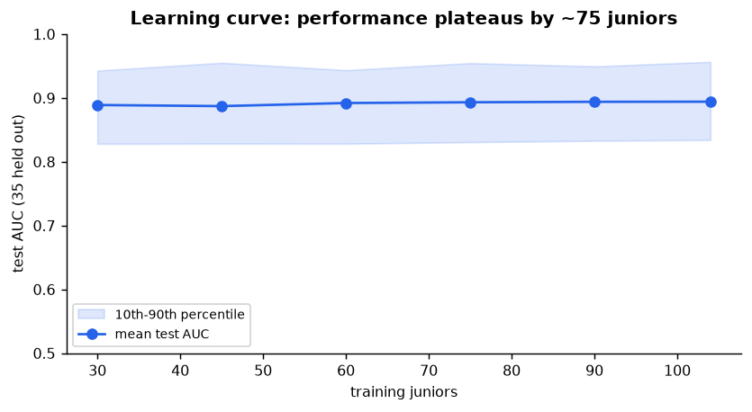
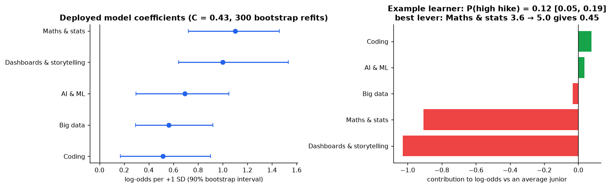
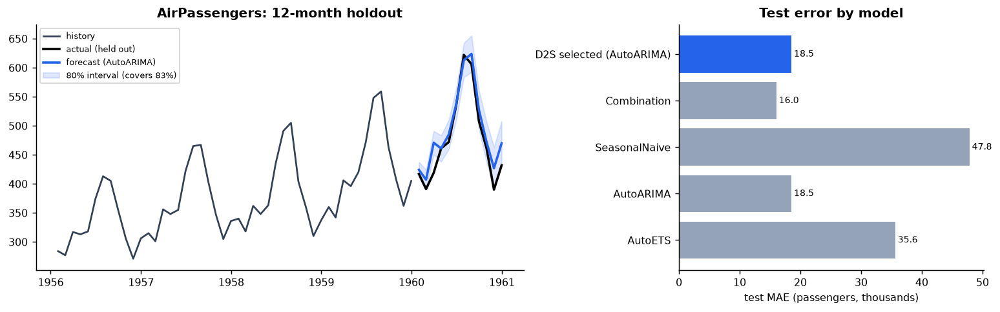
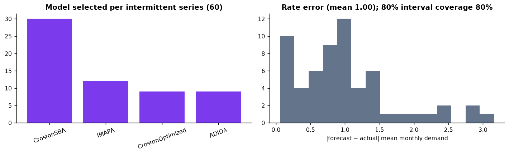
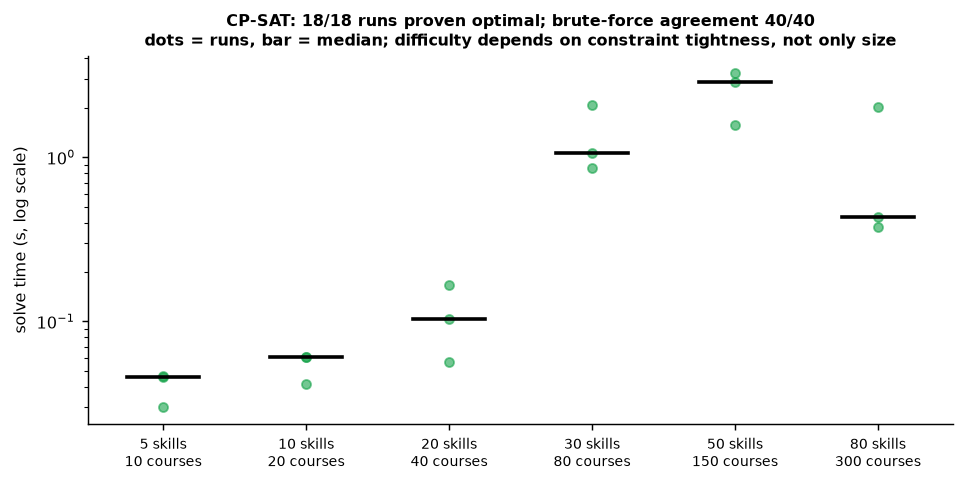
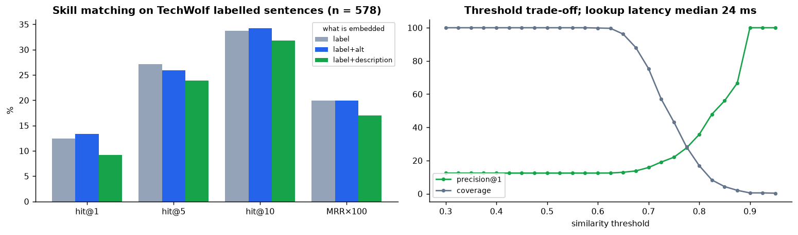

# AI/ML layer: training and test results

Script: `backend/scripts/evaluate_aiml.py` (all numbers below are in `metrics.json`, seeded, reproducible).
Training data for the deployed model: SAS JDS Skill Traits only. The forecaster and the skill matcher
are validated on public test data (the SAS files have no dates or skill labels); those tests check the
modules, they are not project results.

## 1. Junior salary-hike model (deployed in the Gap Map)

**Test protocol:** 200 random stratified 75/25 train/test splits (each model refit on every split),
plus 10× repeated 5-fold out-of-fold predictions for curves and calibration.

| Model | Test AUC (mean, 95% range) | Test accuracy | Brier (lower = better) |
|---|---|---|---|
| Majority baseline | 0.500 | 0.514 | 0.486 |
| **L2 logistic (deployed)** | **0.900** [0.802, 0.993] | **0.849** | **0.124** |
| Random forest | 0.878 | 0.814 | 0.144 |
| Gradient boosting | 0.838 | 0.773 | 0.183 |
| Decision tree (depth ≤ 3) | 0.810 | 0.761 | 0.181 |

- **The simple, explainable model is also the most accurate and best calibrated**, so nothing is
  traded for explainability. With 139 people, flexible models (forest, boosting) overfit.
- Out-of-fold: AUC 0.898, average precision 0.875, Brier 0.117, accuracy 0.871 at threshold 0.5.
  Confusion matrix: 54 true low, 67 true high, 12 false high, 6 false low.
- **Learning curve:** test AUC 0.889 with 30 training juniors and 0.894 with 104, so more data of the
  same kind would add little; the limit is the 1–5 scale's ceiling effect, not sample size.
- **Calibration:** predicted probabilities track observed rates (6-bin reliability curve close to the
  diagonal), so the Gap Map can show probabilities, not just labels.
- **Explainability check:** per-skill contributions add up exactly to the model's log-odds (unit
  test). Example learner (coding 4.4, maths 3.6, AI 4.6, big data 3.8, storytelling 3.4): P = 0.12
  [0.05, 0.19]; best lever maths & stats 3.6 → 5.0 (P → 0.45); no single change reaches 70%, which
  the service reports instead of inventing one.

## 2. Cohort profiler (risk bands, out-of-fold)
| Band | Actually low hike | Actually high hike |
|---|---|---|
| At risk (< 0.4) | 51 | 4 |
| Developing (0.4–0.7) | 9 | 13 |
| On track (≥ 0.7) | 6 | 56 |

93% of juniors in "at risk" truly had a low hike; 90% of "on track" truly had a high hike.

## 3. Forecaster (ready for dated data; not used on SAS data)
| Test | Result |
|---|---|
| AirPassengers, 12-month holdout | Selected **AutoARIMA**, test MAE **18.5** (SeasonalNaive 47.8, AutoETS 35.6, ETS+ARIMA combination 16.0); 80% interval covers 83% of months |
| 60 intermittent series, 6-month holdout | Model choice: CrostonSBA 30, IMAPA 12, CrostonOptimized 9, ADIDA 9; mean demand-rate error 1.00; **80% interval coverage 80.0%**; 2.0 s total |

**Fixed during testing:**
1. Off-anchor dates were silently dropped; they are now snapped to the frequency anchor.
2. Two backtest windows picked the wrong model (SeasonalNaive, MAE 47.8); adaptive windows (up to
   4) plus a combination candidate → AutoARIMA (18.5).
3. Intermittent intervals covered only 58.9% for a nominal 80%. When more than 10% of past months
   are zero, the lower 10th percentile is zero; flooring the bound at zero (plus adaptive conformal
   windows) restored **80.0%**.
4. 500 series: 274 s → 93 s (multi-process for batches of 100+ series).

## 4. Optimiser (CP-SAT)
- **Correctness:** 40 / 40 random small instances matched an exhaustive brute-force search exactly.
- **Speed:** all 18 benchmark runs proven optimal; median 0.03 s (5 skills, 10 courses) to 3.3 s at
  most (50 skills, 150 courses). Difficulty depends on how tight the constraints are, not only on
  size (80 skills / 300 courses solved in 0.4 s median). The real RQ4 problem (5 areas, 9 courses)
  solves in well under a second, so the What-If Simulator can re-solve live.

## 5. Skill matcher (bge-small-en-v1.5)
| What is embedded | Hit@1 | Hit@5 | Hit@10 |
|---|---|---|---|
| Skill label (deployed) | 12.5% | 27.2% | 33.7% |
| Label + alternative labels | 13.3% | 25.9% | 34.3% |
| Label + description | 9.2% | 23.9% | 31.8% |

External validation on TechWolf's 578 hand-labelled job sentences (exact-label scoring among 13,939
ESCO skills, a strict test). Production skill lookup over 2,908 canonical skills: **median 24 ms,
95th percentile 31 ms** per query. Limitation: a small general-purpose model; a job-domain model
is the next upgrade.

## Figures

