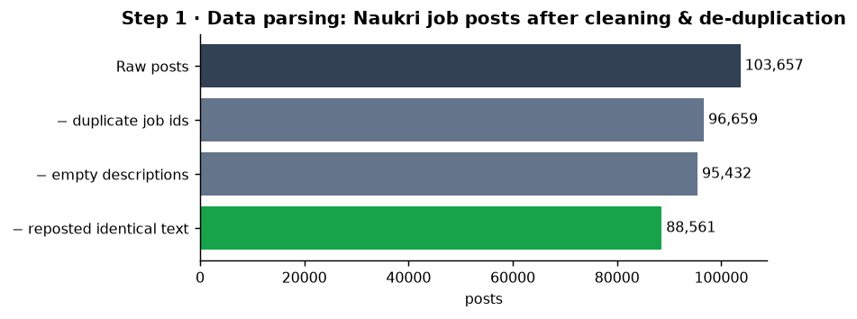
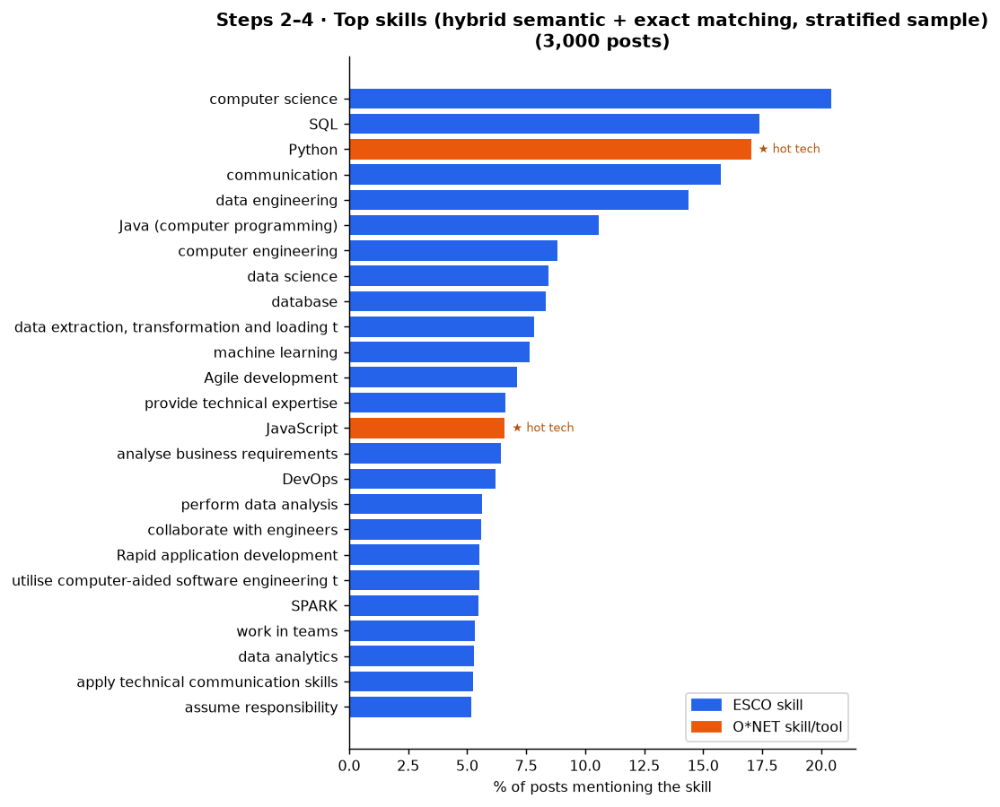
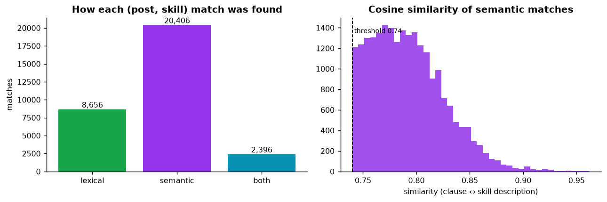
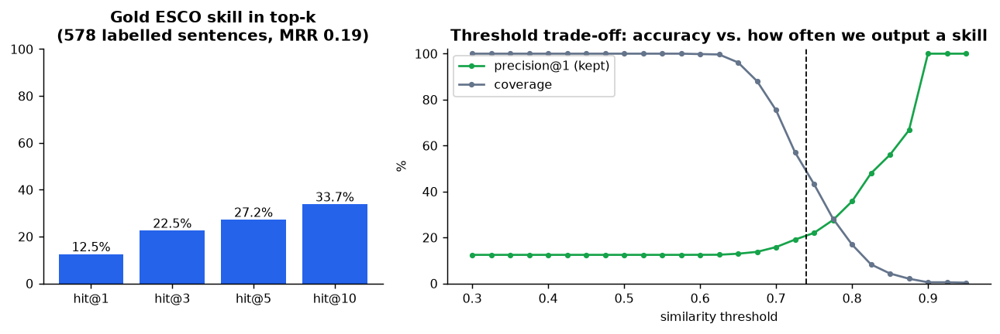
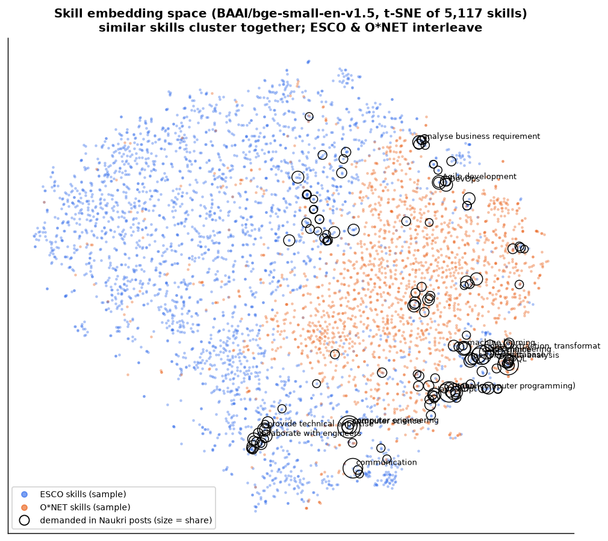
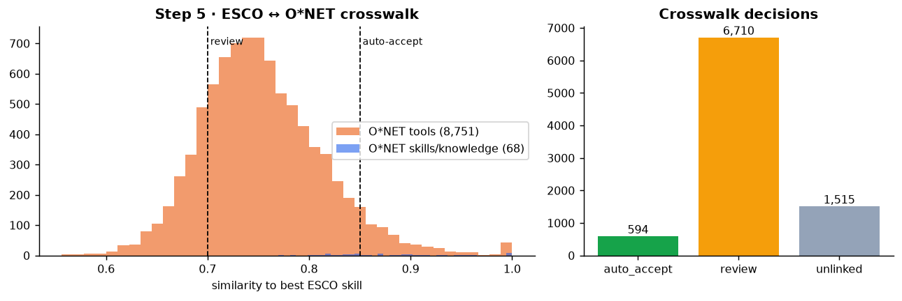
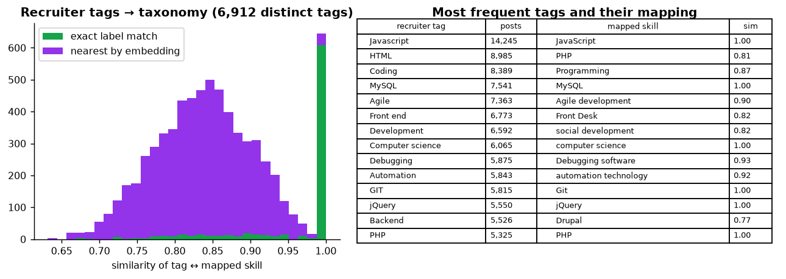
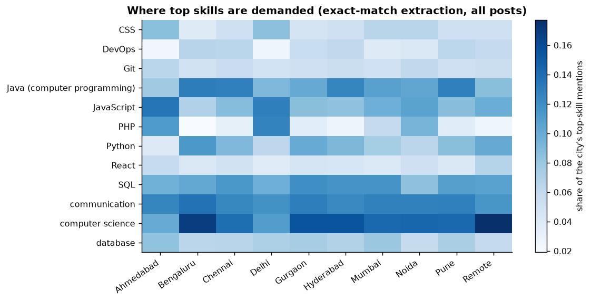
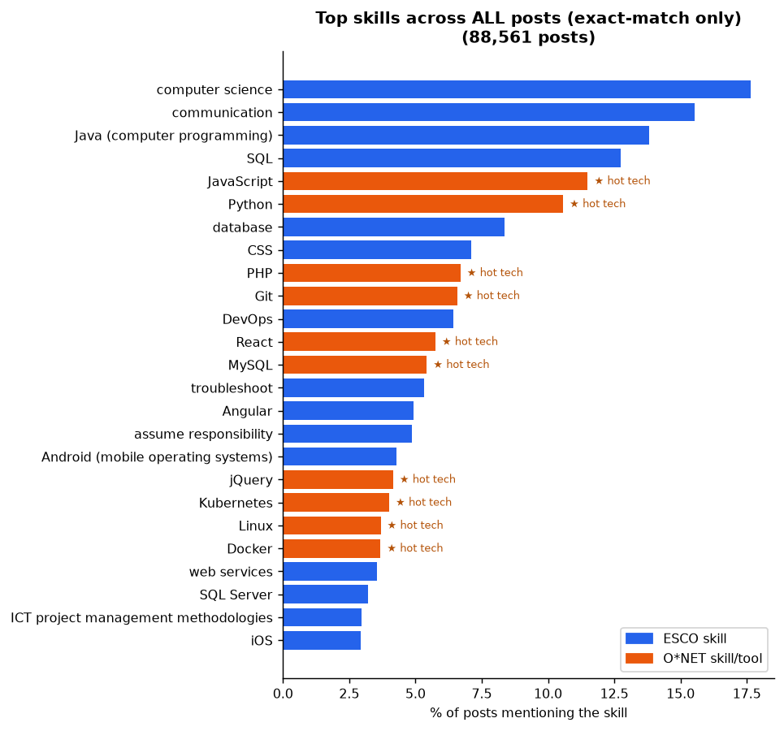
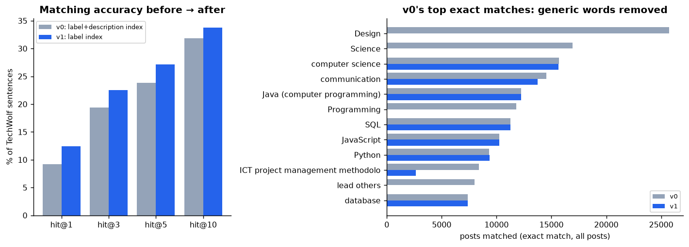

# Ingestion & Normalization: run report

Pipeline: **Data parsing → Skill extraction → Sentence Transformers → Semantic matching → ESCO/O\*NET skill mapping**. Generated by `backend/scripts/make_ingestion_report.py` from the outputs of `backend/scripts/run_ingestion.py`; every number below is measured, none illustrative.

## Data
- **Job posts:** Naukri.com dump (`muhammetakkurt/naukri-jobs-dataset`, CC BY-NC 4.0, research/demo use only): 103,657 raw → **88,561 clean** posts (segments: software_engineer 75,885, data_scientist 12,676).
- **Taxonomy:** O\*NET 30.3 + ESCO v1.2.1 = 22,758 skills.
- **Model:** `BAAI/bge-small-en-v1.5` (index text: label); semantic threshold **0.74**.
- **Evaluation set:** TechWolf skill-extraction test set (CC BY 4.0), job-post sentences each hand-labelled with one ESCO skill.

## Key results
| Metric | Value |
|---|---|
| Posts removed as duplicates (id / identical text) | 6,998 / 6,871 |
| Posts with invalid dates (1970 placeholders) | 935 |
| TechWolf hit@1 / hit@5 / hit@10 | 12.5% / 27.2% / 33.7% (n=578) |
| Exact-match extraction, all posts | 316,376 matches in 76,237 posts |
| Hybrid extraction, 3,000-post sample | 31,458 matches (semantic 20,406, lexical 8,656, both 2,396) |
| Recruiter tags found exactly in taxonomy | 27.4% |
| …of those, recovered from JD text (hybrid / exact-only) | 43.6% / 42.6% |
| O\*NET→ESCO crosswalk decisions | review 6,710, unlinked 1,515, auto_accept 594 |

## What changed between v0 and v1 (and why)
- TechWolf hit@1 9.2% → 12.5%, hit@5 23.9% → 27.2%: index skill **labels** instead of label+description (an ablation showed long ESCO descriptions dilute the match); 5× faster to embed.
- Semantic threshold 0.60 → data-driven (median top-1 similarity on TechWolf); semantic search restricted to ESCO skills (O\*NET product names produced false semantic hits).
- Exact matching no longer uses O\*NET occupational descriptors (`Design`, `Science`, `Programming`), umbrella alt labels (`SAP`, `.NET`), generic one-word alt labels, or reviewed everyday-word tool names (`Analyze`, `Act!`, `REDUCE`, `Google`).
- Boilerplate lines ("Preferred candidate profile", headers, < 4 words) are skipped for semantic matching.

## Limitations (read before using these numbers)
- **Not a time series.** Posting dates are a Dec-2024 scrape snapshot (most posts from Oct–Dec 2024); use only for skill *mix*, never for demand *forecasting*.
- **Strict accuracy metric.** TechWolf counts only the exact ESCO label as correct; many 'misses' are near-synonyms (e.g. *work independently* vs *show initiative*).
- **Small general model.** `bge-small` is not trained on job data; a domain model (e.g. TechWolf ConTeXT-Skill-Extraction, licence not declared) is the next thing to evaluate.
- **Crosswalk thresholds** (0.70 review / 0.85 auto-accept) are starting points to tune on human-reviewed pairs.
- **Precision over recall in exact matching.** Dropping generic one-word alt labels also dropped useful ones (e.g. `leadership` → *lead others*, `agile`); these should return via a reviewed allow-list.

## Figures

