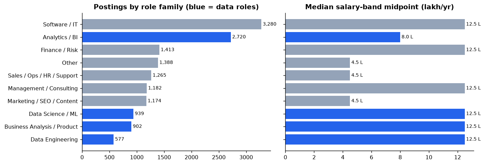
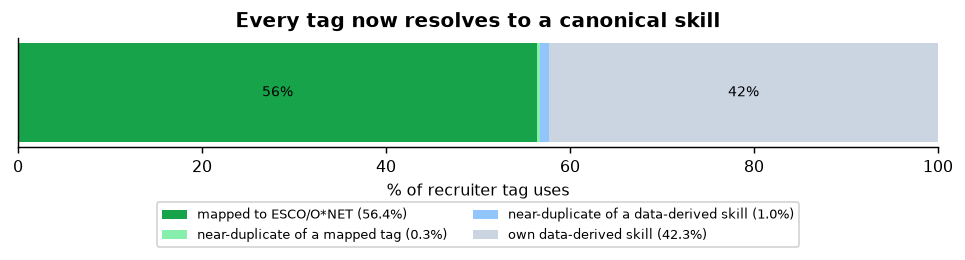
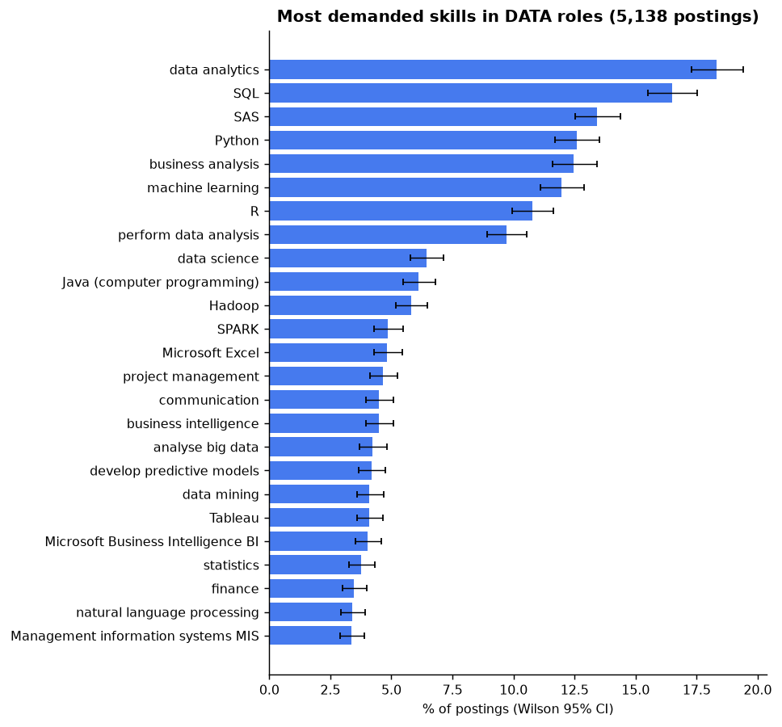
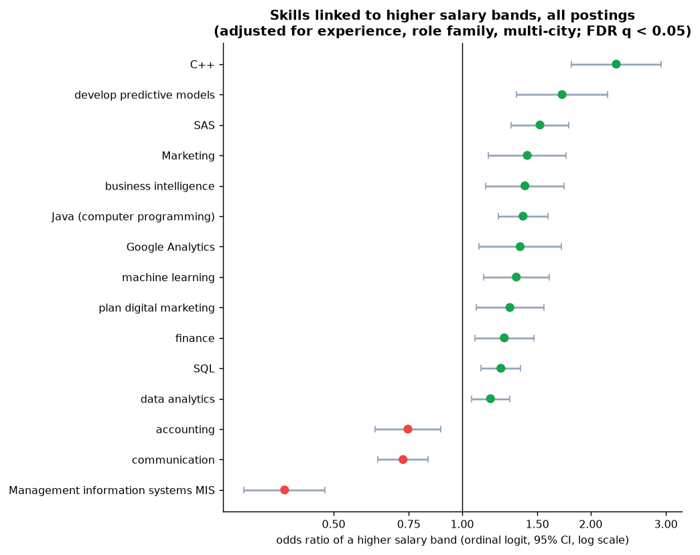
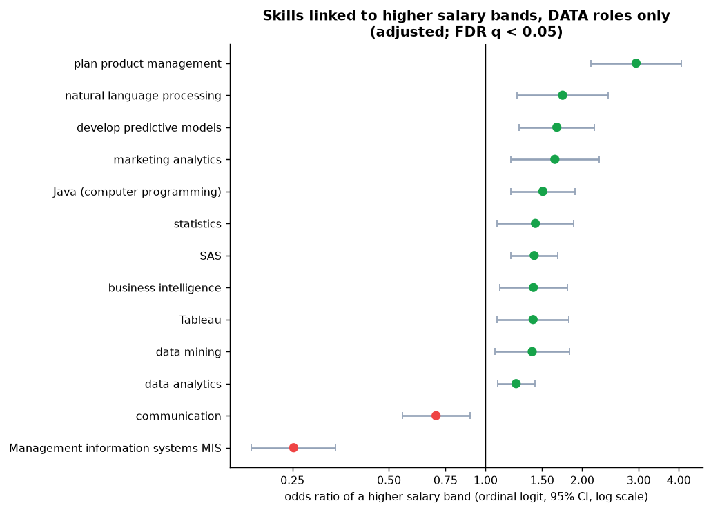
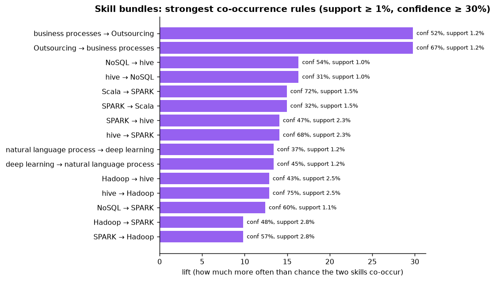
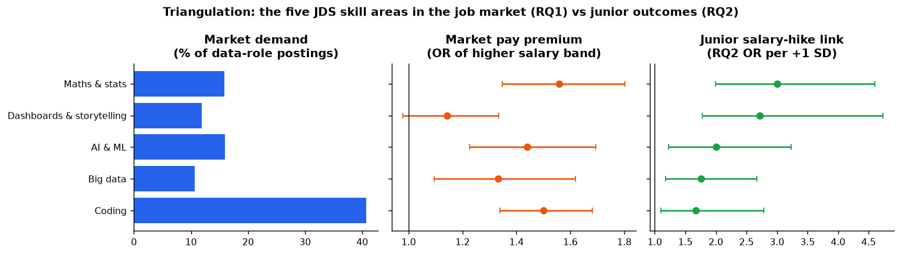
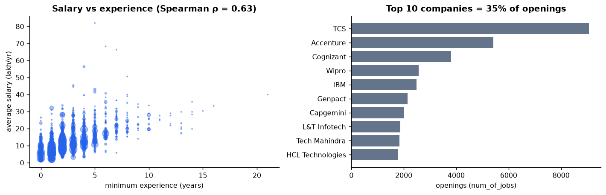

# RQ1: which skills and roles are demanded, and which go with higher pay?

Data: SAS **Analytics Jobs** (14,840 postings after cleaning) and **DataScience Jobs** (1,602
company × title rows, 93,005 openings). Code: `backend/src/d2s/analysis/jobs.py`,
`backend/scripts/run_rq1.py`. Tables: `dataset/processed/rq1/`. **All findings are associations.**

## What was strengthened (vs the first pass)

| Weakness | Fix | Result |
|---|---|---|
| 31% of tag uses in a review queue, 11% unmapped | Every tag resolved to a **canonical skill**: the ESCO/O*NET label where confidently mapped, otherwise a data-derived skill that merges near-duplicate spellings (tag-to-tag similarity ≥ 0.92); 4 wrong semantic matches corrected after a spot-check (e.g. "Analytical" ≠ analytical chemistry) | **100% of tag uses resolved**: 56.4% ESCO/O*NET, 1.3% merged near-duplicates, 42.3% data-derived; 6,604 distinct canonical skills |
| Non-data roles mixed in | **Role families** from transparent title rules | 5,138 postings in 4 data families, analysed separately and compared with the rest |
| Salary medians only | **Ordinal logistic regression** on the six salary bands, controlling for **experience, role family and multi-city**; Benjamini–Hochberg FDR across skills | Adjusted pay premium per skill with 95% CIs |
| Demand as raw counts | **Wilson 95% CIs** on every demand share | |
| No data mining | **Association rules** (support / confidence / lift) for skill bundles | |
| RQ1 isolated from RQ2 | **Triangulation:** the five JDS skill areas measured in the job market, next to their RQ2 effect | |
| DataScience Jobs barely used | Salary vs experience, concentration of openings, outliers | |

## Findings

### 1. Roles
| Role family | Postings | Median salary band midpoint |
|---|---|---|
| Software / IT | 3,280 | 12.5 L |
| **Analytics / BI** | **2,720** | **8.0 L** |
| Finance / Risk | 1,413 | 12.5 L |
| Sales / Ops / HR / Support | 1,265 | 4.5 L |
| Management / Consulting | 1,182 | 12.5 L |
| Marketing / SEO / Content | 1,174 | 4.5 L |
| **Data Science / ML** | **939** | **12.5 L** |
| **Business Analysis / Product** | **902** | **12.5 L** |
| **Data Engineering** | **577** | **12.5 L** |
| Other | 1,388 | 4.5 L |

Analytics/BI is the largest data family but sits a band lower than DS/ML, data engineering and
business analysis.

### 2. Demand in data roles (5,138 postings, Wilson 95% CI)
data analytics 18.3% [17.3, 19.4] · **SQL 16.5%** [15.5, 17.5] · **SAS 13.4%** [12.5, 14.4] ·
**Python 12.6%** [11.7, 13.5] · business analysis 12.5% · **machine learning 12.0%** · R 10.8% ·
data science 6.4% · Java 6.1% · Hadoop 5.8% · Spark 4.8%.

### 3. Pay, adjusted for experience, role family and multi-city (ordinal logit)
Each extra year of minimum experience multiplies the odds of a higher salary band by **1.66**
(all postings) or 1.61 (data roles); pseudo-R² 0.19 / 0.16.

**Data roles, significant at FDR q < 0.05:**
| Higher-pay skills | OR [95% CI] | | Lower-pay skills | OR [95% CI] |
|---|---|---|---|---|
| Product management | 2.95 [2.13, 4.07] | | MIS (management information systems) | 0.25 [0.19, 0.34] |
| Natural language processing | 1.74 [1.25, 2.41] | | Communication | 0.70 [0.55, 0.89] |
| Predictive modelling | 1.67 [1.28, 2.18] | | | |
| Marketing analytics | 1.64 [1.20, 2.26] | | | |
| Java | 1.51 [1.20, 1.90] | | | |
| Statistics | 1.43 [1.09, 1.88] | | | |
| SAS | 1.42 [1.20, 1.68] | | | |
| Business intelligence | 1.41 [1.11, 1.80] | | | |
| Tableau | 1.41 [1.09, 1.82] | | | |
| Data mining | 1.40 [1.07, 1.83] | | | |
| Data analytics | 1.25 [1.09, 1.42] | | | |

All postings: C++ (2.30), predictive models (1.71), SAS (1.52), BI (1.40), Java (1.39),
machine learning (1.34), SQL (1.23) higher; MIS (0.38), communication (0.73), accounting (0.75) lower.

**Reading:** advanced analytics (predictive modelling, NLP, statistics, data mining) and core
tools (SAS, SQL, Java) are linked to higher bands *beyond what experience explains*. Postings
that emphasise MIS reporting or generic "communication" are lower-paid support roles.

### 4. Skill bundles (association rules, data roles)
The big-data stack co-occurs tightly: hive → Hadoop (confidence 75%, lift 13.1), Scala → Spark
(72%, lift 15.2), hive → Spark (68%, lift 14.3); deep learning ↔ NLP (lift 13.6). Training should
teach these as **bundles**, not single tools.

### 5. Triangulation: the five JDS skill areas, market vs junior outcomes
| JDS skill area | Demand in data roles | Market pay OR (adjusted) | RQ2 junior-hike OR per SD |
|---|---|---|---|
| Coding | **40.7%** | 1.50 [1.34, 1.68] | 1.67 [1.10, 2.79] |
| Maths & stats | 15.9% | **1.56** [1.35, 1.80] | **3.01** [1.99, 4.60] |
| AI & ML | 16.0% | 1.44 [1.23, 1.69] | 2.00 [1.23, 3.23] |
| Big data | 10.6% | 1.33 [1.10, 1.62] | 1.76 [1.18, 2.67] † |
| Dashboards & storytelling | 11.9% | 1.14 [0.98, 1.34] (n.s.) | **2.72** [1.77, 4.73] |

- **Maths & stats is the most consistent signal:** paid more in the market *and* the strongest
  junior-hike link. A clear teaching priority.
- **Coding is the baseline expectation** (in 41% of data postings), with a solid premium.
- **Dashboards & storytelling is under-signalled by the market but strongly rewarded inside the
  company:** recruiters rarely list it and it carries no clear pay premium, yet it is the top
  junior-hike predictor. This is a gap institutions can close.
- **Robustness check:** if "reporting" and "MIS" are counted as storytelling (the literal JDS
  definition), its market OR flips to **0.79** [0.69, 0.90], because those terms mark clerical MIS
  jobs. The main table uses the narrow definition (visualisation and BI tools, dashboards,
  storytelling); both are in `dataset/processed/rq1/`.

### 6. DataScience Jobs (company-level)
- Salary rises with experience: **Spearman ρ = 0.63** (p < 10⁻¹⁰⁰).
- Openings are spread across many companies (HHI 0.021). The top 10 (TCS 9,064, Accenture 5,425,
  Cognizant 3,813, Wipro, IBM, Genpact, Capgemini, LTI, Tech Mahindra, HCL) hold **35%** of openings.
- **Job-weighted average salary is 9.7 L vs a 11.9 L median across rows:** the volume of openings
  sits with large IT-services firms that pay below the per-company median.
- 39 high-salary outliers (e.g. Flipkart Senior Data Scientist 82 L, Uber/Emirates Senior Data
  Engineer ~66–68 L) were **kept**: they are plausible senior roles at high-paying firms, with
  small opening counts.

## Limitations
- Salary is a **band** (six ordered levels), modelled ordinally rather than as exact pay; postings
  are a 2024–25 sample, not a census.
- **Associations, not causes:** a skill's premium may reflect the kind of company or role that
  asks for it.
- Role families come from title rules (9.4% remain "Other"). Recruiter tags are incomplete.
- About **1.3%** of tag uses were merged by spelling similarity; a few merges are imperfect
  (e.g. off-page vs on-page optimisation). 42% of tag uses are data-derived skills without an
  ESCO/O*NET code; they are analysed but not linked to the international taxonomy.
- † Big data's RQ2 link is a conditional (suppressor) effect; see the RQ2/RQ3 report.

## Figures

