# RQ2 & RQ3: skills and traits associated with junior growth and senior success

Data: SAS-provided **JDS Skill Traits** (139 junior data scientists) and **SDS Personality Traits**
(161 senior, customer-facing data scientists). Code: `backend/src/d2s/analysis/traits.py`,
`backend/scripts/run_rq2_rq3.py`. Tables: `dataset/processed/rq23/`. All results are seeded and
reproducible; **all findings are associations, not causal effects.**

## 1. Data preparation findings

| Check | JDS | SDS |
|---|---|---|
| Rows / missing values | 139 / 0 | 161 / 0 |
| Outcome classes (low / high) | 66 / 73 | 76 / 85 |
| Majority-class baseline accuracy | 52.5% | 52.8% |
| Fully identical rows | 0 | 0 |
| Duplicate IDs (rows) | 2 IDs (4 rows), 1 with different outcomes | 9 IDs (18 rows), 7 with different outcomes |
| Out-of-range values | 0 (all within 1–5) | n/a (normalised scores 17–68) |
| IQR outliers | AI & ML: 18 (low tail) | agreeableness: 5 |
| Column fixes | `maths-stats_skills` → `maths_stats_skills` | `" extraversion"` (leading space), `"success_ classification_ high_low"` |
| Max VIF (multicollinearity) | 1.45 | 1.44 |

- **Duplicate IDs are kept.** Rows sharing an ID have entirely different scores, and most have
  different outcomes, so they are different people with re-used or masked IDs (the brief notes that
  the data is masked), not double entries.
- **Outliers are kept.** They are valid scale values, and rank-based tests are robust to them.
- **Ceiling effect (JDS):** the share of juniors scoring the maximum 5.0 is 58% for dashboard &
  storytelling, 49% for AI & ML, 45% for coding and 41% for maths-stats. The 1–5 scale stops
  distinguishing the strongest juniors, so effects are likely *under*-estimated.

## 2. Results

### RQ2: junior skills → high salary hike

| Skill | Mean high / low | Rank-biserial [95% CI] | Holm p | Odds ratio per +1 SD [95% CI] |
|---|---|---|---|---|
| Dashboard & storytelling | 4.85 / 3.81 | **0.59** [0.45, 0.72] | < 0.001 | 2.72 [1.77, 4.73] |
| Maths-stats | 4.71 / 3.83 | **0.55** [0.40, 0.70] | < 0.001 | **3.01** [1.99, 4.60] |
| Coding | 4.64 / 3.85 | 0.49 [0.31, 0.64] | < 0.001 | 1.67 [1.10, 2.79] |
| AI & ML | 4.82 / 4.28 | 0.36 [0.19, 0.52] | < 0.001 | 2.00 [1.23, 3.23] |
| Big data | 3.94 / 3.75 | 0.12 [−0.09, 0.32] | 0.217 (n.s.) | 1.76 [1.18, 2.67] † |

| Model (repeated 5-fold CV, 20×) | Accuracy | Balanced accuracy | ROC AUC |
|---|---|---|---|
| Majority baseline | 0.525 | 0.500 | 0.500 |
| **L2 logistic regression** | **0.864** | **0.861** | **0.904** |
| Decision tree (depth ≤ 3) | 0.757 | 0.756 | 0.809 |

Permutation test (500 label shuffles): CV AUC 0.903 vs null mean 0.494, **p = 0.002**.

**Decision rule (tree):** juniors with dashboard & storytelling > 4.15, maths-stats > 3.70 and
coding > 4.65 had a high hike in 50 of 56 cases; those with storytelling ≤ 4.15 and maths-stats
≤ 4.60 had a low hike in 26 of 26 cases.

**Reading:** the high-hike group scores higher on four of five skills. **Communicating results
(dashboards & storytelling) and quantitative foundations (maths-stats)** are the strongest signals;
big data alone is not.

### RQ3: senior Big Five traits → high success

| Trait | Mean high / low | Rank-biserial [95% CI] | Holm p | Odds ratio per +1 SD [95% CI] |
|---|---|---|---|---|
| Openness to experience | 48.5 / 33.3 | **0.77** [0.65, 0.87] | < 0.001 | **9.09** [4.65, 24.5] |
| Conscientiousness | 53.7 / 35.7 | **0.76** [0.62, 0.87] | < 0.001 | **9.78** [5.59, 21.3] |
| Extraversion | 48.9 / 36.9 | 0.57 [0.42, 0.71] | < 0.001 | 2.78 [1.28, 6.60] |
| Agreeableness | 47.7 / 41.1 | 0.30 [0.09, 0.50] | 0.002 | 1.96 [0.99, 4.40] (CI includes 1) |
| Neuroticism | 36.1 / 36.3 | 0.07 [−0.12, 0.26] | 0.454 (n.s.) | 2.44 [1.57, 4.69] † |

| Model (repeated 5-fold CV, 20×) | Accuracy | Balanced accuracy | ROC AUC |
|---|---|---|---|
| Majority baseline | 0.528 | 0.500 | 0.500 |
| **L2 logistic regression** | **0.924** | **0.922** | **0.963** |
| Decision tree (depth ≤ 3) | 0.907 | 0.907 | 0.938 |

Permutation test: CV AUC 0.949 vs null mean 0.501, **p = 0.002**.

**Decision rule (tree):** every senior with openness ≤ 38.5 was low-success (52 of 52); openness
> 38.5 *and* conscientiousness > 36.5 *and* agreeableness > 40.5 was high-success in 79 of 83.

**Reading:** **openness to experience and conscientiousness** are by far the strongest correlates of
senior success, followed by extraversion.

† **Suppressor effects:** big data (JDS) and neuroticism (SDS) show *no* difference on their own but a
positive coefficient once the other features are held constant. Each is mildly negatively correlated
with the strong predictors (e.g. neuroticism vs extraversion −0.25). For neuroticism, the coefficient
moves from −0.01 (p = 0.94) alone to 1.37 (p = 0.001) with all five traits. These are *conditional*
associations in a small sample; we report them as such and do not draw recommendations from them.

## 3. Method notes (for the report)
- Univariate: Mann-Whitney U (bounded, skewed scales), rank-biserial effect size with 2,000-sample
  bootstrap CIs, Holm correction across five tests.
- Multivariable: standardised L2 logistic regression, with **C chosen by inner 5-fold CV on
  log-loss** (JDS C = 0.43, SDS C = 1.44). A first run tuned C on AUC; AUC ignores coefficient scale,
  so it over-shrank the coefficients (SDS odds ratios ≈ 1.26 despite Cohen's d ≈ 1.8). Switching to
  log-loss fixed this and also improved CV accuracy (JDS 0.817 → 0.864, SDS 0.901 → 0.924).
- Decision tree: depth ≤ 3, ≥ 10 samples per leaf; permutation importance on held-out folds.
- Odds-ratio CIs: 1,000 bootstrap refits at the selected C.

## 4. Limitations
- Small samples. The CV intervals are wide (e.g. JDS AUC fold range 0.77–0.99); conclusions rest on
  effect direction and size, not on exact values.
- Cross-sectional and observational data: associations, not causes. For example, high performers
  may also receive more storytelling opportunities.
- JDS ceiling effect, plus a different scale per dataset (1–5 vs normalised scores).
- SDS separation is unusually clean (openness ≤ 38.5 → 52/52 low success), which can indicate
  curated or sample data; results should be validated on another cohort before policy use.

## Figures
| | JDS (RQ2) | SDS (RQ3) |
|---|---|---|
| Distributions | 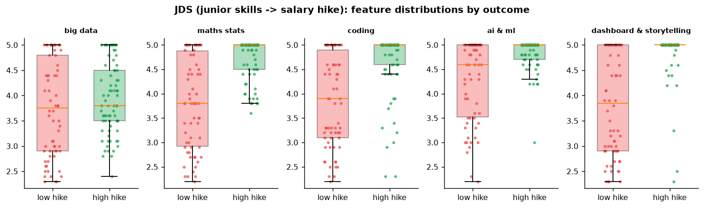 | 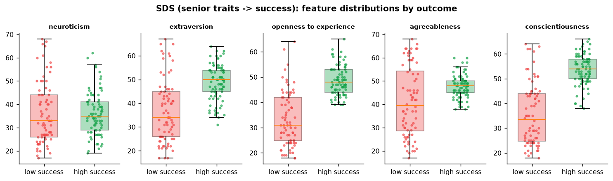 |
| Effect sizes | 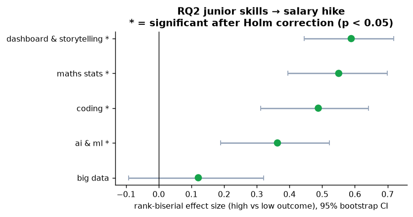 | 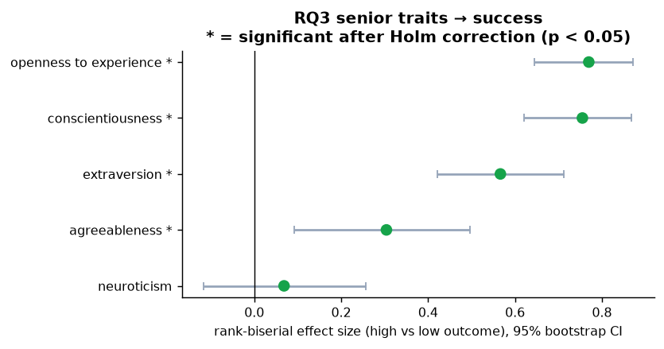 |
| Correlations | 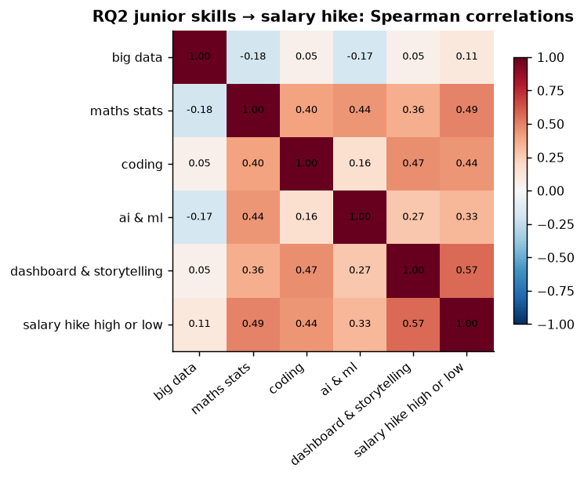 | 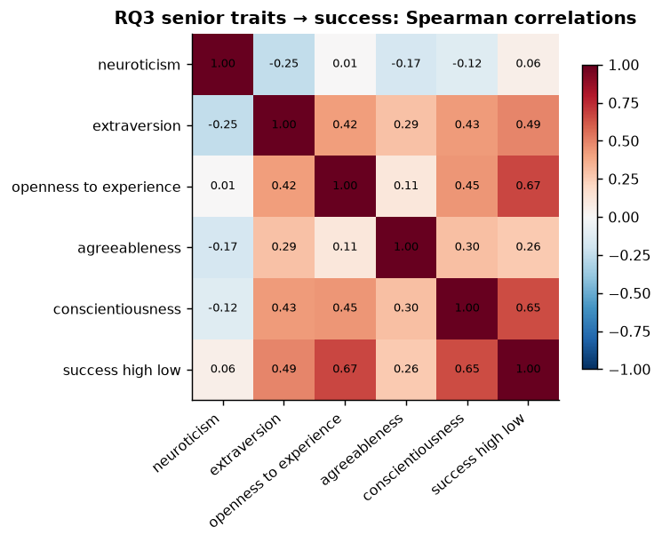 |
| Models vs baseline | 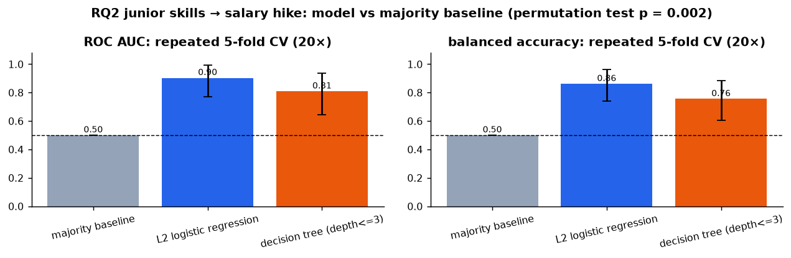 | 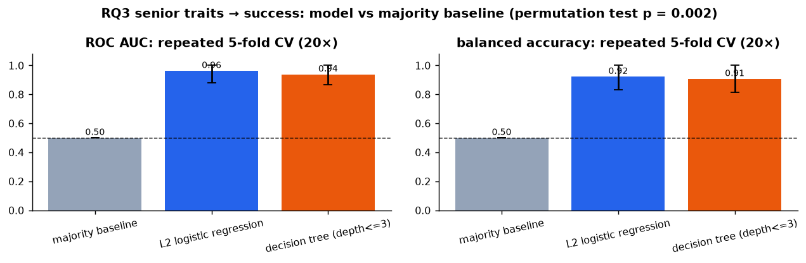 |
| Odds ratios | 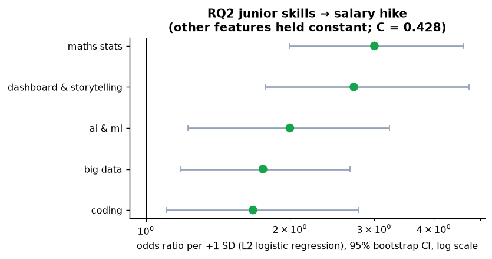 | 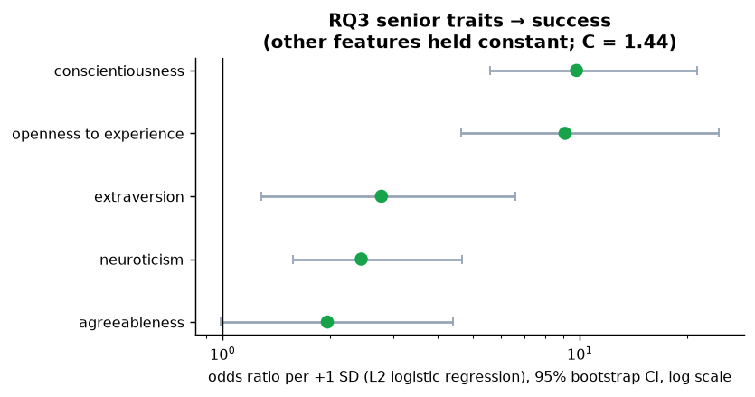 |
| Decision tree | 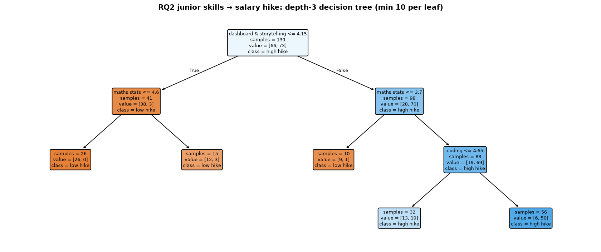 | 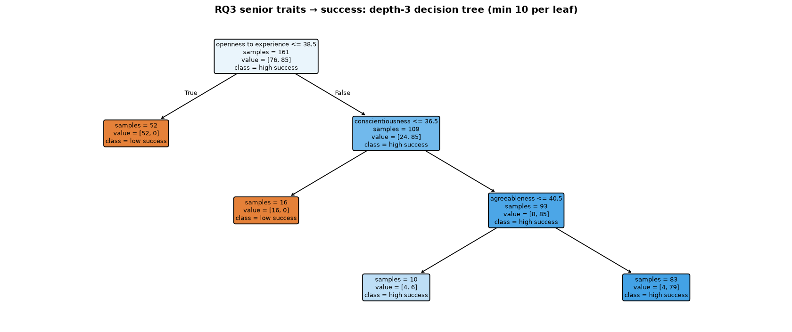 |
