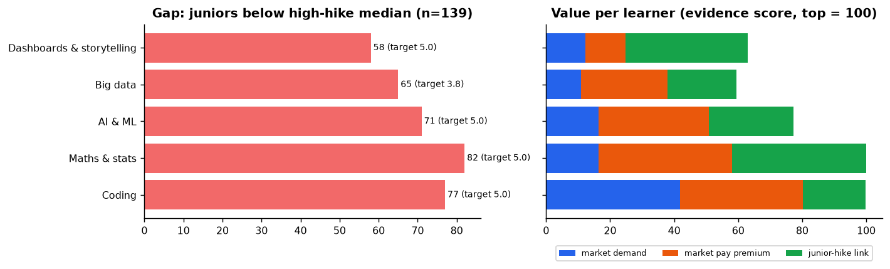
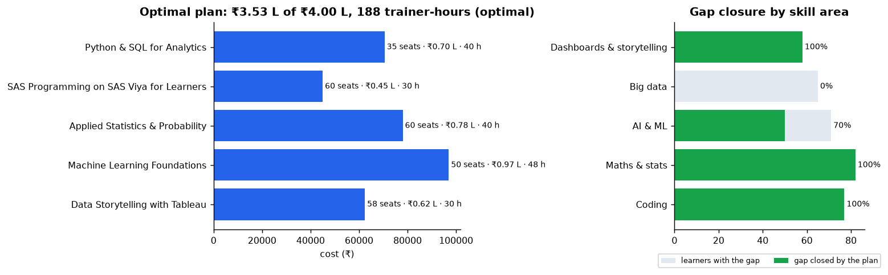
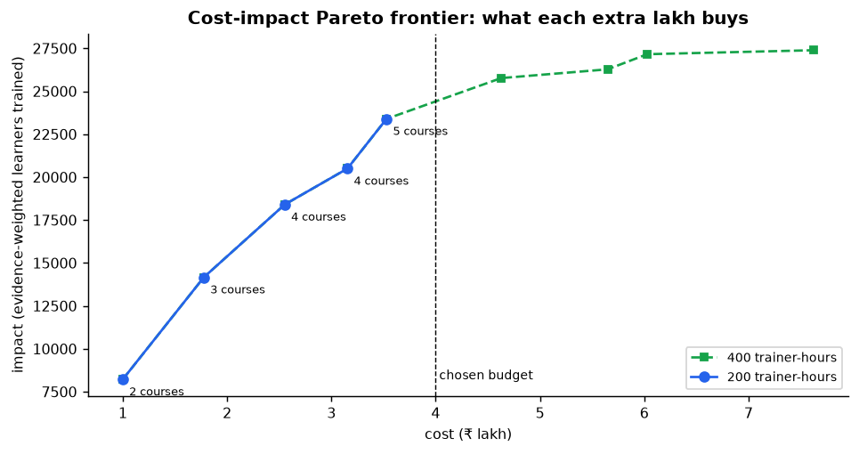
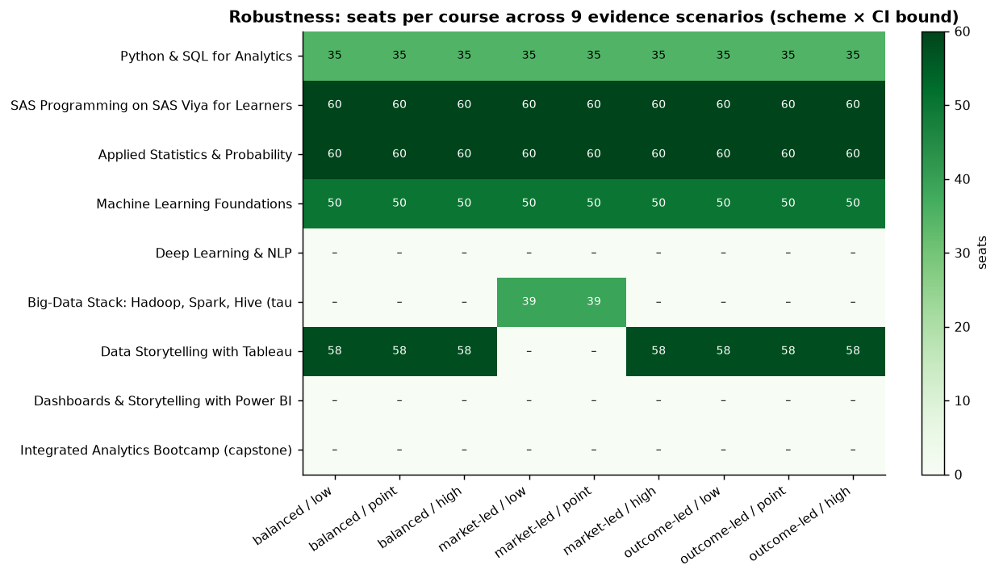

# RQ4: what should an institution teach first, within its budget?

Prescriptive analytics: the RQ1–RQ3 evidence feeds an integer optimisation model (Google OR-Tools
CP-SAT) that chooses **which courses to run and for how many learners**, under budget, trainer-hour,
seat, batch-size, prerequisite and either/or constraints. Code: `backend/src/d2s/analysis/plan.py`,
`backend/src/d2s/engine/`, `backend/scripts/run_rq4.py`. Tables: `dataset/processed/rq4/`.

## Inputs: what is data and what is assumed

| Input | Source | Values |
|---|---|---|
| **Skill gaps** | **Data (JDS)**: juniors scoring below the high-hike group's median in each area, with the 139 JDS juniors as the illustrative cohort | Maths & stats 82 · Coding 77 · AI & ML 71 · Big data 65 · Dashboards & storytelling 58 |
| **Value of closing a gap** | **Data (RQ1 + RQ2)**: equal-weighted mix of market demand share, log market pay odds ratio (adjusted) and log RQ2 junior-hike odds ratio, each scaled to its maximum | Maths & stats 100 · Coding 99.7 · AI & ML 77.3 · Dashboards 62.9 · Big data 59.4 |
| **Uncertainty** | **Data**: the same score at the CI lower and upper bounds, under 3 weighting schemes (balanced / market-led / outcome-led), giving 9 scenarios | see robustness |
| **Courses, costs, seats, hours** | **Assumption**, checked against public sources (`course_catalogue_assumptions.csv`) | see below |
| **Budget / trainer capacity** | **Assumption** (scenario) | ₹4.0 lakh, 200 trainer-hours |

**Cost assumptions and their sources**
- Trainers: **₹1,430–2,000 per hour**, the upper-mid of the ₹250–2,000/h range reported for data
  science and analytics trainers in India (KnowledgeHut corporate-training pricing; Glassdoor and
  PayScale listings). This is deliberately conservative: in-house faculty would cost less.
- Software: **SAS Viya for Learners is free** for academic, non-commercial use; **Tableau is free for
  students** (1-year academic licence); **Power BI Desktop is free**. So per-seat costs for these
  courses are materials only.
- GPU for DL/NLP: ~20 GPU-hours per learner at ~₹100/h. Indian GPU cloud is ₹67–92/h under the
  IndiaAI subsidy, and L4-class GPUs cost $0.35–0.80/h.

Personality traits (RQ3) are **not** modelled as trainable courses: personality is relatively
stable, so those findings inform mentoring, role allocation and assessment, not curriculum.

## The optimal plan (₹4.0 L budget, 200 trainer-hours): proven optimal

| Course | Seats | Cost | Trainer-hours |
|---|---|---|---|
| Applied Statistics & Probability | 60 | ₹0.78 L | 40 |
| SAS Programming on SAS Viya for Learners | 60 | ₹0.45 L | 30 |
| Machine Learning Foundations | 50 (max) | ₹0.97 L | 48 |
| Python & SQL for Analytics | 35 | ₹0.71 L | 40 |
| Data Storytelling with Tableau | 58 | ₹0.62 L | 30 |
| **Total** | **263** | **₹3.53 L** (₹0.47 L unspent) | **188 / 200** |

**Gap closed:** Coding 100% · Maths & stats 100% · Dashboards & storytelling 100% · AI & ML 70%
(ML is capped at 50 seats) · Big data 0%.

### Why some courses were left out (forced re-solve)
| Course not chosen | Impact if forced in | Reason |
|---|---|---|
| Integrated Bootcamp | −20.7% | high fixed cost and 90 trainer-hours for only partial coverage of each area |
| Deep Learning & NLP | −12.8% | needs ML first and 40 more trainer-hours; displaces foundation courses |
| Big-Data Stack | −5.7% | lowest evidence score of the five areas; does not fit in the remaining hours |
| Power BI storytelling | −1.1% | either/or with Tableau; Tableau closes the full gap at the same per-seat cost |

## Sensitivity: what would change the decision?
- **Money is not the constraint.** ₹0.47 L is left unspent, and +₹1 L adds **0** impact (exact
  re-solve).
- **Trainer capacity is the real bottleneck, and it comes in whole courses.** The LP relaxation says
  an extra trainer-hour is worth 27.5 impact, but the exact integer re-solve with +40 hours gives
  **0**. The next course (Big Data) needs 40 hours *and* ₹1.1 L more at the same time, so neither
  extra resource helps on its own. This is why the plan is optimised with integer programming
  rather than a simple LP.
- **What extra trainer-hours buy** (generous budget):

| Trainer-hours | Added to the plan | Impact | Gap closed |
|---|---|---|---|
| 200 | (base: 5 courses) | 23,391 | AI & ML 70%, big data 0% |
| 240 | + Big-Data stack | 25,767 (**+10.2%**) | big data 62% |
| 280 | + Deep Learning & NLP | 27,158 (**+16.1%**) | AI & ML 96% |
| 400 | + Bootcamp | 27,389 (+17.1%) | gains level off |

  **Implication: add about 40–80 trainer-hours (new faculty, or trainers shared across
  institutions) together with about ₹1.1–2.5 L. Extra budget without extra trainers buys nothing.**
- **Pareto frontier (200 h):** each lakh buys roughly 3.5k–8.2k impact up to ₹3.53 L. Gains are
  lumpy because the best course combination changes at each budget level. Beyond ₹3.53 L the line
  stops: no further course fits in 200 trainer-hours. The 400-hour frontier continues to ₹7.6 L
  with clearly diminishing gains (only +231 impact for the last ₹1.6 L).

## Robustness across 9 evidence scenarios

| Course | Chosen in | Seats |
|---|---|---|
| **Applied Statistics & Probability** | **9 / 9** | 60 in every scenario |
| **SAS Programming (VFL)** | **9 / 9** | 60 in every scenario |
| **Machine Learning Foundations** | **9 / 9** | 50 in every scenario |
| **Python & SQL** | **9 / 9** | 35 in every scenario |
| Data Storytelling (Tableau) | 7 / 9 | 58; replaced by Big Data only in the market-led low/point scenarios |
| Big-Data Stack | 2 / 9 | 39 (market-led low/point only) |
| DL & NLP, Power BI, Bootcamp | 0 / 9 | at ₹4 L / 200 h |

**Safe core = Statistics + SAS + ML foundations + Python & SQL, with identical seat counts in all 9
scenarios.** Storytelling is included unless the institution weights *only* what job postings
advertise; RQ2 shows it is the second-strongest junior-hike signal, so we recommend keeping it.

## Recommendation for an institution (illustrative cohort)
1. **Run the safe core now:** statistics (60 seats), SAS on Viya for Learners (60), ML foundations
   (50), Python & SQL (35). Total about ₹2.9 L.
2. **Add Tableau storytelling (58 seats, ₹0.62 L):** strongly linked to junior salary hikes and
   under-advertised by the market.
3. **To go further, add trainer capacity, not only budget:** +40 h with about ₹1.1 L adds the
   Big-Data bundle; +80 h adds DL/NLP. Sharing trainers across institutions is the cheapest route.
4. **Use RQ3 for people decisions:** openness and conscientiousness are associated with senior
   success, so use them in mentoring, project allocation and structured assessment, not as courses.

## Limitations
- Costs, seats and trainer-hours are **assumptions**, checked against public sources; edit the
  catalogue CSV and rerun. An earlier version with higher per-seat costs (before the source check)
  made the budget, not trainers, the binding constraint: **the conclusion depends on cost levels**,
  which is why they are documented.
- "Gap" uses the JDS cohort as a stand-in for an institution's own assessment data; target = the
  high-hike group's median (5.0 for four areas, 3.8 for big data).
- Coverage % (how much of a learner's gap one seat closes) is an assumption, not measured.
- Single-term plan; learners within an area are valued equally. Multi-period sequencing and
  multi-institution pooling are designed but not run here.

## Sources for cost assumptions
- [KnowledgeHut: corporate training pricing in India](https://www.knowledgehut.com/blog/enterprise/corporate-training-pricing-india) · [Glassdoor: data science trainer jobs, India](https://www.glassdoor.co.in/Job/india-data-science-trainer-jobs-SRCH_IL.0,5_IN115_KO6,26.htm) · [PayScale: corporate trainer hourly rate, India](https://www.payscale.com/research/IN/Job=Corporate_Trainer/Hourly_Rate/6bccea8e/Late-Career-Training)
- [SAS Viya for Learners](https://www.sas.com/en_my/software/viya-for-learners.html) · [Tableau for Students](https://campustechnology.com/articles/2013/03/06/tableau-to-offer-analytics-software-free-to-students.aspx) · [Power BI Desktop](https://www.microsoft.com/en-gb/power-platform/products/power-bi/desktop)
- [GPU cloud pricing in India 2026](https://tensordata.com/blog/gpu-cloud-pricing-india-2026) · [India GPU cloud rental pricing 2026](https://ecorpit.com/india-gpu-cloud-rental-pricing-h100-b200-2026/)

## Figures

