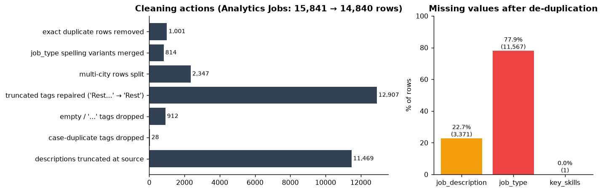
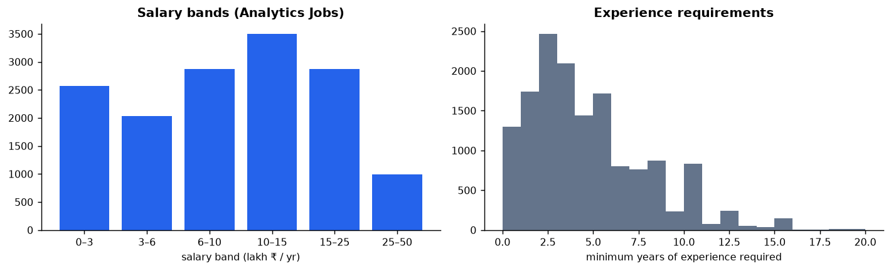
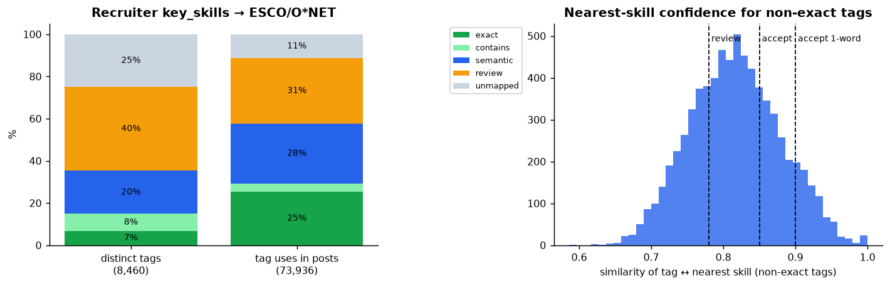
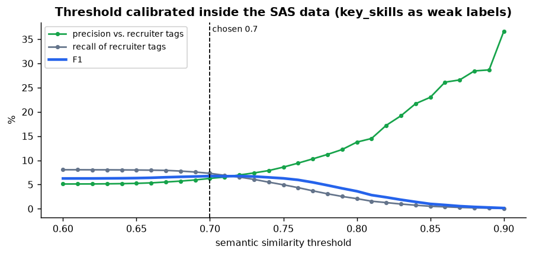
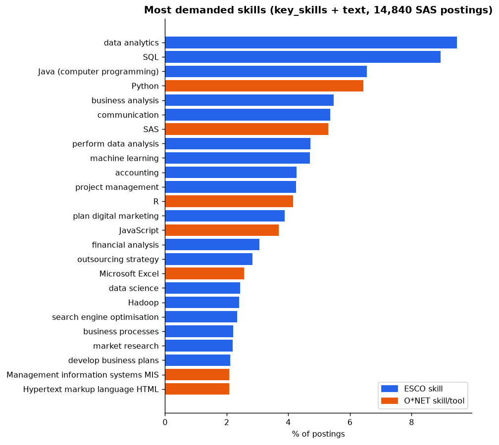
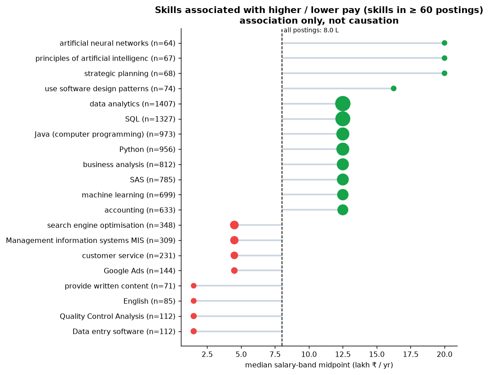
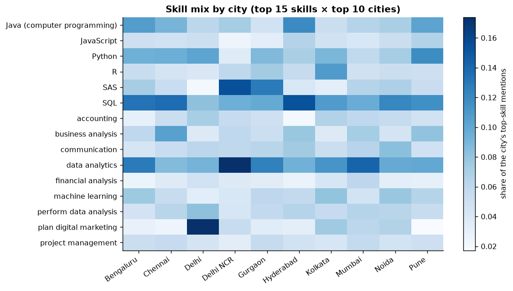
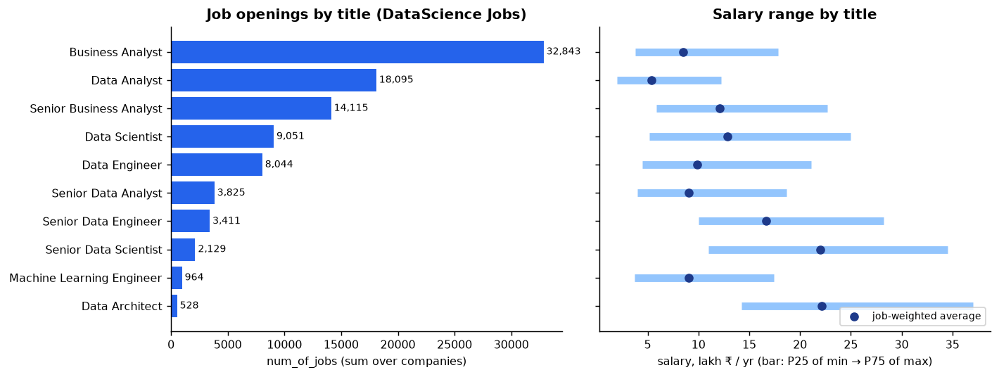
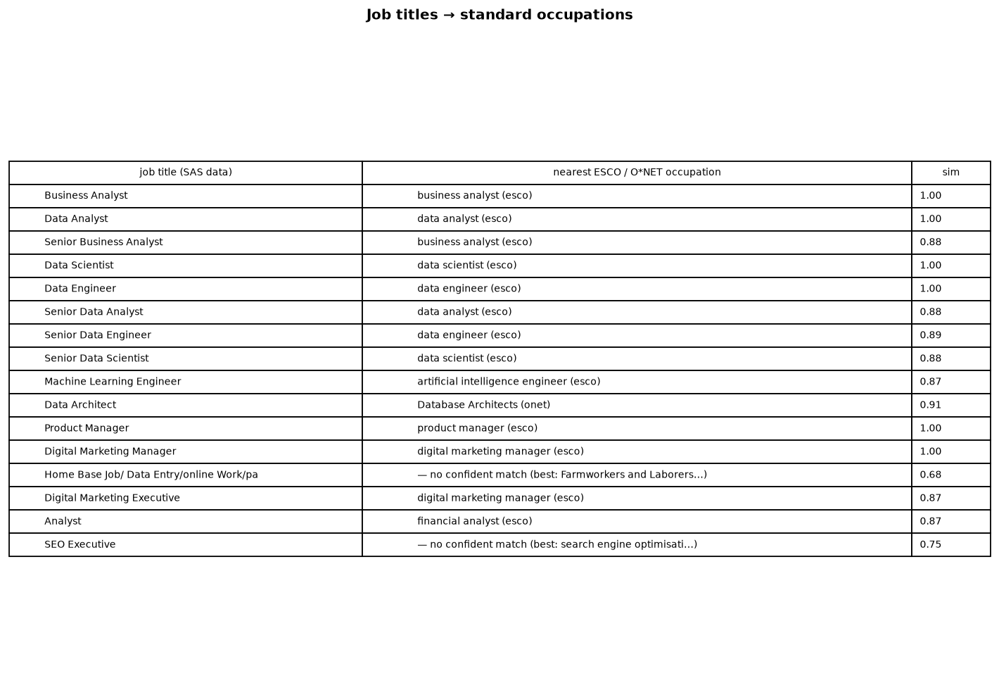

# SAS hackathon data: ingestion & normalization report

**Data used: only the SAS-provided files** (`Analytics Jobs.csv`, `DataScience Jobs.csv`). ESCO v1.2.1 + O\*NET 30.3 are used purely as the skill/occupation *vocabulary*. Generated by `backend/scripts/make_sas_report.py`; every number is computed from the run outputs.

Pipeline: **Data parsing → Skill extraction → Sentence Transformers (`BAAI/bge-small-en-v1.5`) → Semantic matching → ESCO/O\*NET skill mapping**

## 1. Data preparation
| Step | Count |
|---|---|
| Raw rows → kept after exact-duplicate removal | 15,841 → **14,840** (1,001 duplicates) |
| Missing `job_description` / `job_type` / `key_skills` | 3,371 / 11,567 / 1 |
| `job_type` spelling variants merged (Analytics/analytics/ANALYTICS/analytic…) | 814 |
| Multi-city rows split into a location list | 2,347 |
| Descriptions truncated at source (end in `...`) | 11,469 |
| Tags: total / truncated & repaired / empty-or-`...` dropped / case-duplicates dropped | 74,884 / 12,907 / 912 / 28 |
| Experience `"5-10 yrs"` → `exp_min`, `exp_max`; salary `"10to15"` → lakh min/max/mid | all rows parsed |
| DataScience Jobs: salaries `"7.8L"` → numeric lakh | 1,602 rows, 642 companies, 93,005 openings |

## 2. Skill mapping results
- **Recruiter key_skills → ESCO/O\*NET:** 8,460 distinct tags: exact 577, contains-a-known-skill 685, semantic (≥0.85, one-word ≥0.90) 1,724, review queue (0.78–0.85) 3,363, unmapped 2,111. Weighted by usage, **57.7% of tag uses are mapped**; 31.0% await review.
- **Semantic matching on description text was tested and excluded.** Calibrated against recruiter tags, its best F1 was only 6.8% (threshold 0.7: precision 6.3%, recall 7.3%). The descriptions are truncated at source (~100 chars), too short for reliable meaning-based matching. Only exact skill names in the text are used.
- **Final table:** 45,869 (posting, skill) pairs across 14,118 postings; by signal {'key_skills': 38071, 'text': 4497, 'key_skills+text': 3301}.
- Overall median salary-band midpoint: **8.0 lakh**. Highest-paying skills (≥ 60 postings): strategic planning (20.0 L), principles of artificial intelligence (20.0 L), artificial neural networks (20.0 L), use software design patterns (16.2 L), data analytics (12.5 L).

## 3. Limitations
- Descriptions are **truncated (~100 chars)** in the source, so text adds little beyond key_skills; key_skills is the primary signal.
- Recruiter tags are **weak labels** (incomplete, noisy): calibration precision is a lower bound.
- Salary is a **band** (midpoint used); skill–salary links are associations, not causal effects.
- `job_type` is 78% missing, so it cannot be used for segmentation.

## Figures

